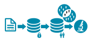
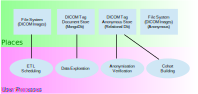
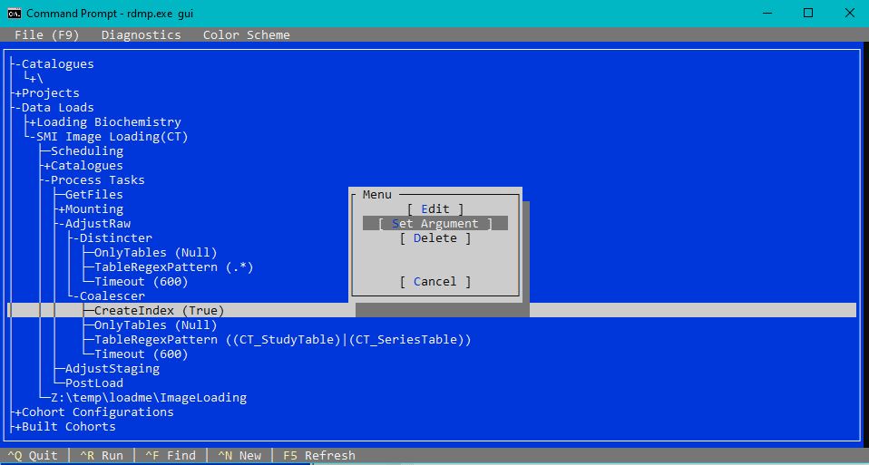
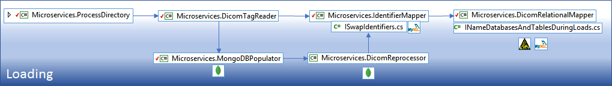

## CI Status

[](https://github.com/smi/SmiServices/actions/workflows/main.yml)
[](https://github.com/SMI/SmiServices/actions/workflows/codeql.yml)
[](https://codecov.io/gh/SMI/SmiServices)


Version: `5.3.0`

# SMI Services

## Contents

1. [Introduction](#10-introduction)
    1. [Overview](#11-overview)
    2. [Glossary or Terminology](#12-glossary-or-terminology)
    3. [Background and Context](#13-background-and-context)
    4. [Goals and Technical Requirements](#14-goals-and-technical-requirements)
    5. [Out of Scope](#15-out-of-scope)
    6. [Assumptions](#16-assumptions)
2. [Solutions](#20-solutions)
    1. [Deliverable Solution / Design](#21-deliverable-solution--design)
    1. [Test Plan](#22-test-plan)
    1. [Monitoring and Alerting Plan](#23-monitoring-and-alerting-plan)
    1. [Release / Roll-out and Deployment Plan](#24-release--roll-out-and-deployment-plan)
    1. [Rollback Plan](#25-rollback-plan)
    1. [Associated Documentation](#26-associated-documentation)
3. [Further Considerations](#30-further-considerations)
    1. [Human Resource Requirements](#31-human-resource-requirements)
    2. [Security Considerations](#32-security-considerations)
    3. [Legal and Ethical considerations](#33-legal-and-ethical-considerations)
    4. [Accessibility considerations](#34-accessibility-considerations)
    5. [Support considerations](#35-support-considerations)
4. [Future Work](#40-future-work)
    1. [Residual work estimates and timelines](#41-residual-work-estimates-and-timelines)
    1. [Open Questions](#42-open-questions)
5. [End Matter](#50-end-matter)
    1. [Related Work](#51-related-work)
    1. [Acknowledgments](#52-acknowledgments)
6. [Microservices](#microservices)
    1. [Data Load Microservices](#data-load-microservices)
    1. [Image Extraction Microservices](#image-extraction-microservices)
7. [.sln Overivew](#sln-overview)
8. [Building](#building)
9. [Running](#running)
10. [Dependencies](#dependencies)
11. [Scalability](#scalability)

## 1.0 Introduction

### 1.1 Overview

SMI Services is a suite of tools designed to deliver scalable dicom image indexing for cohort building and extraction in anonymised sub sets (e.g. for research). It is an Extract, Transform and Load tool (ETL) for imaging data.



The problem addressed is how to enable linking of dicom metadata with other clinical data (e.g. electronic health records - EHR). The context in which it was developed is the loading and anonymisation of metadata for 10 years of Scottish national clinical imaging data (2 petabytes).

The following processes are solved by the suite:

-   Robust parallel loading of dicom metadata into a relational database where it can be linked to EHR data
-   Anonymisation of the dicom metadata within the relational database
-   Cohort building by linking the relational database tables with other EHR data (e.g. biochemistry results, prescriptions etc)
-   Producing anonymous dicom image files for a subset of the repository

Stakeholders likely to interact with this suite include Research Coordinators (building research extracts) and Data Analysts (loading data, verifying anonymisation etc)

### 1.2 Glossary or Terminology

For RDMP terms see the [RDMP Glossary](https://github.com/HicServices/RDMP/blob/develop/Documentation/CodeTutorials/Glossary.md)

For DICOM specific terms see the [DICOM tag browser](https://dicom.innolitics.com/ciods) or [DICOM specification]

Dicom tags are key/value pairs that assist in understanding the provenance of a dicom image. They contain information such as PatientID, PatientAge, StudyDescription etc. The [DICOM specification] describes what tags are required and which are optional. Each tag has a specific datatype (date, text, float etc). The specification supports tree structure tags called Sequences. A Sequence can contain subtags which are also Sequences resulting in a tree data structure. Tags can also support multiple elements (i.e. array datatype), this is called multiplicity.

### 1.3 Background and Context

Historically dicom images are held in a clinical PACS or in an imaging informatics platform such as [XNAT]. SmiServices can function standalone or side by side with such tools. The unique features of SmiServices are it's ability to present large imaging datasets as indexed flat tables in a relational database (MySql, Sql Server, Postgres or Oracle) where they can be linked with cohorts/EHR datasets. This is a worthy addition since it allows for cohort building and extraction using existing tools that data analysts are familiar with (R, Sql scripts, [RDMP Cohort Builder](https://github.com/HicServices/RDMP) etc).

### 1.4 Goals and Technical Requirements

The goals are to load dicom metadata, build cohorts and extract anonymous image subsets.

This requires dotnet, RabbitMQ, RDMP, MongoDb and a Relational Database. For more info on setting up SmiServices see [Deployment](#deployment).

SmiServices benefits from:

-   Running on a cluster (many VMs running many copies of each service)
-   A Parallel File System (e.g. [BeeGFS](https://en.wikipedia.org/wiki/BeeGFS) or [Lustre](https://www.lustre.org/))

### 1.5 Out of Scope

SmiServices does not support imaging workflows (e.g. running image algorithms).

It also does not have an API for external communication (e.g. Dicom Query Retrieve or FHIR/HL7 etc). The imaging metadata produced by SmiServices can be queried using MongoDb queries or SQL.

Once the image metadata is in the relational database then cohorts can be created using standard cohort building tools (e.g. RDMP Cohort Builder, R, SQL). The specifics of cohort building are not covered in this document as that is covered elsewhere (in the documentation of each tool).

### 1.6 Assumptions

SmiServices assumes that database servers are optimised and properly resourced to store the volume of image metadata anticipated. ETL is robust and can deal with outages and database stability issues (e.g. lock collisions) but these can errode system performance.

The solution is designed for large image collections (i.e. billions of images). It supports flexible schema definitions such that only the tags required for cohort building (and the image file paths) are loaded. Therefore successful usage of the tool requires a basic understanding of dicom tag significance and an appropriately large body of images to justify its use.

## 2.0 Solutions

### 2.1 Deliverable Solution / Design

Microservices is a design in which each component is self contained and has a single responsibility. Decoupling processes allows for easier maintenance and testability. Any number of copies of each service can be run at the same time allowing scalability through parallel processing.

Communication between services is through RabbitMQ. RabbitMQ is one of the most popular open source message brokers, supporting both high-scale and high-availability requirements.

Data is promoted sequentially between places (file system, databases etc). Each promotion is carried out by one or more service types in a chain. For example promoting the dicom tag data to the MongoDb document store involves the [ProcessDirectory], [DicomTagReader] and [MongoDBPopulator] services. Since only tag data is promoted, there are no excessive storage overheads associated with data existing in multiple places at once within the system (duplication). Each place supports specific user processes (see below) and the technology chosen is based on it's suitability for those processes:



| User Process               | Description                                                                                                                                                                                                                                 | Application(s)                                                 |
| -------------------------- | ------------------------------------------------------------------------------------------------------------------------------------------------------------------------------------------------------------------------------------------- | -------------------------------------------------------------- |
| ETL Scheduling             | Users uses command line tool to pick specific directories of images for loading to MongoDb                                                                                                                                                  | [ProcessDirectory]                                             |
| Data Exploration           | Users explore full dicom metadata to identify anonymisation requirements, useful tags for cohort building and trigger promotion of subsets of images to the relational database (e.g. Modality CT for 20010)                                | mongo command line, MongoDB Compass etc and [DicomReprocessor] |
| Anonymisation Verification | Users review reports on the effectiveness of the MongoDb->Relational Database anonymisation pipeline and create new anonymisation/redaction rules where the system has failed to correctly redact the tag data                              | [IsIdentifiableReviewer]                                       |
| Cohort Building            | Users view link EHR data with the relational database data to produce extractable image subsets of the archive that fit specific research projects (e.g. CT head scans between 2015-2018 where the patient had 3+ prescriptions for drug X) | R, SQL, [RDMP], [ExtractImages]                                |

MongoDb was chosen for the 'Data Exploration' process because it is a 'document store' - which means it is able to store the full tree structure of dicom metadata. MongoDb improves access speed to the metadata tags and allows for aggregation and search activities. MongoDb is designed to scale well and supports sharding and replication for when the number of dicom files held grows beyond single db instance capabilities.

The slowest part of ETL is reading dicom files from disk (even with a parallel file system). The use of MongoDb allows this to be done only once per image regardless of how it is subsequently processed downstream. Pixel data tags are not loaded to MongoDb since these would inflate storage and processing requirements and are less useful to for the task of Data Exploration.

Relational Databases were chosen for the Anonymous Tag Store since this is the format most commonly used with EHR datasets and cohort building tools. The ability to directly link anonymous dicom metadata to research study lists and other EHR datasets held in relational databases is a core design requirement of SmiServices.

The data load service wraps the [RDMP] data load engine and so supports MySql, Sql Server, Oracle and Postgres. In addition it allows tailoring how corrupt/duplicate data is loaded. Using an [RDMP] load also allows for tailoring the load process after deployment and for expanding upon the cohort building table schema(s) over time as new tags are identified as useful for cohort building.

Implicit in the [DICOM Specification] is the hierarchical layout of tags (Patient, Study, Series, Image). Each dicom image file contains the complete tag list for its study/series. This means that tag data is replicated in each file and only the Image level tags are uniqiue. The use of [RDMP] and it's imaging plugin [RDMP Dicom] allows for automatic aggregation of these Patient/Study/Series level tags. This results in a far smaller table for cohort building which improves query performance where there is not a need to query image level tags.

The exact tags required for the Cohort Building process will vary over time and may not be known at the outset. For this reason the ETL microservices support any schema so long as the table column names match a known DICOM tag. To assist in schema building, a standalone application [Dicom Template Builder] was created.

In order to protect patient privacy, all tag data in the relational database should be anonymous. This is supported by several services and design choices:

-   The Cohort building schema you create should contain only tags that have low volumes of identifiable data (e.g. StudyDescription but not PatientName )
-   Identifiable data can be detected using the [IsIdentifiable] tool
-   Identifiable data can be summarised and redacted using the [IsIdentifiableReviewer] tool
-   PatientID can be substituted for an anonymous identifier with the ETL service [IdentifierMapper].

The user process of ensuring these steps have been undertaken correctly is called 'Anonymisation Verification'.

Error recovery is handled through RabbitMQ. When a service fails to acknowledge the successful processing of a message it is automatically requeued and sent to a different service. If a message cannot be processed after several attempts it is sent to a 'dead letter queue' where it can be evaluated later. Services subscribe to a 'Control queue' which allows for safe shutdown of the service e.g. for system maintenance.

The most error prone section of ETL is entry to the relational database which is where primary key collisions and corrupt data must be reconciled (e.g. 2 images in the same study containing conflicting definitions of StudyDescription). [RDMP Dicom] contains several modules designed to mitigate these issues, more information about these can be found in the [RDMP Dicom data load documentation](https://github.com/HicServices/RdmpDicom/blob/develop/Documentation/DataLoad.md).

The use of microservices not only ensures scalability and error recovery but also provides a degree of future proofing. If a requirement emerges for a new step in ETL that cannot be handled by RDMP then a new microservice can be slotted into the load chain. Additionally if a step is not needed for a given deployment it can be cut out (e.g. removing the [IdentifierMapper] step of ETL) by editing the SmiServices configuration files.

Configuration of the services comes from three places:

-   The command arguments given to the service on startup
-   A [YAML configuration file](./data/microserviceConfigs/default.yaml)
-   [RDMP]

### 2.2 Test Plan

SmiServices and [RDMP] contain both automated unit and integration tests. These tests are automatically run on each code commit to the repository. New features are written in a 'pull request' which is independently tested and approved. Pull requests can be from developers working on the project (branches) or from external collaborators (forks).

User testing of the services can be done using the [Docker Image](https://github.com/jas88/smideploy).

A tool ([BadMedicine.Dicom]) has been created that generates synthetic test DICOM images. [BadMedicine.Dicom] can be used to generate images for testing the service. It includes support for generating placeholder pixel data so that file size can be modelled. This helps with non functional testing of hardware when architecting an SmiServices deployment.

Cohort building can be tested by generating synthetic EHR data with the sibling tool [BadMedicine]. When used with the same seed as [BadMedicine.Dicom] relational database tables or CSV files of synthetic medical can be generated (e.g. biochemistry, prescribing, demography).

Code coverage metrics are collected and hosted on [Coveralls](https://coveralls.io/github/SMI/SmiServices). This shows what proportion of lines of code in the codebase are covered by automated testing. It also allows visualisation of which parts of the codebase have less coverage. This ensures that no complex areas of suite are untested. Automated alerts are generated on pull requests that substantially lower the code coverage (add a lot of code without tests).

Static analysis of the codebase is performed with [LGTM](https://lgtm.com/projects/g/SMI/SmiServices/alerts/). This identifies common coding errors such as missing null checks. Automated alerts are generated on pull requests in which such errors are detected.

Manually testing and debugging integration/unit tests requires having the relevant tool dependencies installed. Tests are decorated with an attribute that indicates which dependencies(if any) are required. These include:

-   RequiresRelationalDb (Microsoft Sql Server / MySql)
-   RequiresMongoDb (MongoDb)
-   RequiresRabbit (RabbitMQ Server)

Tests with the respective attributes will only run when these services exist in the test/development environment. Connection strings/ports for these services can be found in:

-   TestDatabases.txt (Relational Databases)
-   default.yaml (RabbitMQ / MongoDb)
-   Mongo.yaml
-   Rabbit.yaml
-   RelationalDatabases.yaml

For setting up the RDMP platform databases see https://github.com/HicServices/RDMP/blob/master/Documentation/CodeTutorials/Tests.md

### 2.3 Monitoring and Alerting Plan

Both SmiServices and [RDMP] use [NLog] for logging. A number of additional systems are incorporated into SmiServices for logging/audit:

-   The health of running services can be monitored using the RabbitMQ admin console
-   Each message sent by a service has a GUID associated with it. Records loaded into the relational database include the GUIDs of all services that acted on the tag data during ETL (see [Logging through the IMessageHeader](./src/common/Smi.Common/README.md#logging-through-the-imessageheader)).
-   Anonymisation effectiveness is verified using [IsIdentifiable] and can be visualised using the [IsIdentifiableReviewer]
-   All ETL activities are audited in the hierarchical RDMP logging database. This includes run duration, record counts, error messages during load etc.

### 2.4 Release / Roll-out and Deployment Plan

The technical process of Release is covered in [RELEASING.md](./docs/RELEASING.md)

The latest binaries can be downloaded from the [GitHub releases page](https://github.com/SMI/SmiServices/releases/latest).

Each release has a [Changelog] describing all changes made to the codebase (additions, bugfixes etc). Changelog entries include a link to the 'git diff' which shows code changes and more technical descriptions of changes.

The data load microservices wrap the [RDMP] DLE. It is therefore important to ensure that the RDMP gui/CLI client and platform databases are maintained at a compatible version with the binary shipping with SmiServices. RDMP updates are backwards compatible and natively support running old clients against new versions of the platform database. Dependencies are managed with [dependabot](https://github.blog/2020-06-01-keep-all-your-packages-up-to-date-with-dependabot/) which automatically generates a 'pull request' when updates are available to [RDMP Dicom]. If there are any compatibility issues this will surface in the automated integration testing of the pull request.

The easiest way to consume SmiServices is through the [Docker Image](https://github.com/jas88/smideploy).

For a more adaptable/scalable setup or to use existing infrastructure (databases etc), you will need to:

-   Install RabbitMq
-   Install MongoDb
-   Install a relational database (MySql, SqlServer, Postgres or Oracle)
-   [Install RDMP](https://github.com/HicServices/RDMP) and setup platform databases on a Sql Server.

After all services are in place:

-   Import the [queue definitions](./data/rabbitmqConfigs) into RabbitMQ via the admin web interface (or from command line). Make any changes for vhost etc if desired
-   Download the software assets for the latest [SmiServices Release](https://github.com/SMI/SmiServices/releases) and unzip the appropriate service e.g. `smi-services-v4.0.0-linux-x64.tgz`

Configure 'default.yaml'

-   Update the credentials to match your RabbitMQ and MongoDb instance (you can ignore RDMP, Redis etc for now).
-   Remove the `TEST.` prefix on queue names

### 2.5 Rollback Plan

SmiServices releases are backwards compatible and released as a self contained executable package. Rolling back to an earlier version of the software involves only deleting the new binary and restoring the old one.

Breaking changes to SmiServices can be expected only when the major version number is incremented. This is consistent with [semantic versioning](https://semver.org/). In such cases the changelog should describe the changes and how to rollback.

### 2.6 Associated Documentation

Each SmiServices dependency contains its own documentation. Follow the link from the package name for help.

| Package                                                                     |                                                                                                                                                                                                                                                                                                                           Status                                                                                                                                                                                                                                                                                                                           |
| :-------------------------------------------------------------------------- | :--------------------------------------------------------------------------------------------------------------------------------------------------------------------------------------------------------------------------------------------------------------------------------------------------------------------------------------------------------------------------------------------------------------------------------------------------------------------------------------------------------------------------------------------------------------------------------------------------------------------------------------------------------: |
| [HIC.TypeGuesser](https://github.com/HicServices/TypeGuesser)               | [](https://github.com/HicServices/TypeGuesser/actions/workflows/dotnet.yml) [](https://coveralls.io/github/HicServices/TypeGuesser?branch=master) [](https://lgtm.com/projects/g/HicServices/TypeGuesser/alerts/) [](https://buildstats.info/nuget/HIC.TypeGuesser) |
| [FAnsiSql](https://github.com/HicServices/FAnsiSql)                         |                                                                                                [](https://github.com/HicServices/FAnsiSql/actions/workflows/dotnet-core.yml) [](https://lgtm.com/projects/g/HicServices/FAnsiSql/alerts/) [](https://www.nuget.org/packages/HIC.FansiSql/)                                                                                                 |
| [DicomTypeTranslation](https://github.com/HicServices/DicomTypeTranslation) |                                                             [](https://github.com/HicServices/DicomTypeTranslation/actions/workflows/dotnet-core.yml) [](https://lgtm.com/projects/g/HicServices/DicomTypeTranslation/alerts/) [](https://buildstats.info/nuget/HIC.DicomTypeTranslation)                                                              |
| [RDMP](https://github.com/HicServices/RDMP)                                 |                                [](https://github.com/HicServices/RDMP/actions?query=workflow%3ABuild) [](https://coveralls.io/github/HicServices/RDMP?branch=develop) [](https://lgtm.com/projects/g/HicServices/RDMP/alerts/) [](https://buildstats.info/nuget/HIC.RDMP.Plugin)                                |
| [RDMP.Dicom](https://github.com/HicServices/RdmpDicom)                      |                                                                                            [](https://github.com/HicServices/RdmpDicom/actions/workflows/dotnet-core.yml) [](https://lgtm.com/projects/g/HicServices/RdmpDicom/alerts/) [](https://buildstats.info/nuget/HIC.RDMP.Dicom)                                                                                            |
| [Dicom Template Builder]                                                    |                                                                                                                                                       [](https://travis-ci.org/HicServices/DicomTemplateBuilder) [](https://lgtm.com/projects/g/HicServices/DicomTemplateBuilder/alerts/)                                                                                                                                                        |
| [IsIdentifiable](https://github.com/SMI/IsIdentifiable)                     |                                                                                                  [](https://github.com/SMI/IsIdentifiable/actions/workflows/dotnet-core.yml) [](https://lgtm.com/projects/g/SMI/IsIdentifiable/alerts/) [](https://www.nuget.org/packages/IsIdentifiable/)                                                                                                   |

## 3.0 Further Considerations

### 3.1 Human Resource Requirements

Setting up an SmiServices deployment on a large volume of imaging data requires a number of staff with skills in the following areas:

-   Parallel file system setup and optimisation
-   Database administration (MongoDb and chosen Relational Database)
-   Deployment and configuration skills ([YAML](https://yaml.org/), )
-   Infrastructure management (setting up VMs, server instances etc)

Once running SmiServices is designed to be used by staff with a background in cohort building and data analysis. Familiarity with SQL is beneficial but not required by all analysts if the SQL is abstracted into library methods or gui applications (e.g. [RDMP] Cohort Builder)

The task of loading identifiable data from disk and understanding it in the MongoDb requires:

-   Knowledge of the MongoDb query language
-   Appropriate governance training for working with identifiable data (e.g. NHS contract)

### 3.2 Security considerations

SmiServices is designed to run in a secure offline environment in which network firewalls prevent interaction between any VMs and Servers with the outside world. There are no web frontends or management consoles designed for external access. All user interaction with tools in the suite should be done over secure VPN via SSH or secure Remote Desktop (for graphical applications).

SmiServices relies on the security of the environment into which it is deployed. Database access permissions and file permissions should be configured appropriately to the users operating the system. Where possible connection strings and credentials should use 'integrated security' (i.e. the user account credentials not username/password). SmiServices also supports supplying passwords in environment variables for when that is an acceptable solution. If supplying passwords in the configuration file directly then this file should be protected from all non root users (i.e. with appropriate file access permissions).

### 3.3 Legal and Ethical considerations

SmiServices users must have appropriate governance permissions for accessing data.

Users handling the ETL and anonymisation processes must have approval to view identifiable information.

Cohort Building takes place in the anonymised relational database and therefore may require a lower level of governance approval.

### 3.4 Accessibility considerations

SmiServices command line tools are written in dotnet and work with any windows or linux terminals (bash, powershell etc). Accessibility of terminals is typically good with inbuilt or compatible addons for controlling text size, converting text to speech etc.

All commands run in the RDMP windows gui client can [also be run directly on the command line](https://github.com/HicServices/RDMP/blob/develop/Documentation/CodeTutorials/RdmpCommandLine.md) which allows for scripting and alternate access routes. RDMP also features a Terminal User Interface (TUI) which mirrors the design of the gui client.



Both [IsIdentifiableReviewer] and the RDMP TUI support specifying alternative colour schemes for text where contrast or colors used are an accessibility issue for users.

### 3.5 Support considerations

Support for users of SmiServices is via [GitHub Issues](https://github.com/SMI/SmiServices/issues). Tickets can also be raised in [RDMP] if the issue does not seem to be related specifically to the microservices component of the suite.

## 4.0 Future Work

### 4.1 Residual work estimates and timelines

SmiServices is feature complete for the loading, linking, cohort building and extraction of anonymous images. Future work will focus on improvements such as:

-   Better pixel anonymisation
-   Support for natural language processing (NLP) of structured reports in cohort building
-   Project specific UID anonymisation

Not all of the above features will be directly implemented in the SmiServices repository and may be consumed as external pluggable resources (e.g. through RDMP cohort builder plugins).

### 4.2 Open Questions

Outstanding questions and feature debates can be seen in the [GitHub Issues](https://github.com/SMI/SmiServices/issues) and [GitHub Discussions](https://github.com/SMI/SmiServices/discussions) pages of SmiServices repository.

## 5.0 End Matter

### 5.1 Related Work

Many image processing tools have relational database backends and most support export in interchange formats such as CSV / XLS or querying APIs. This means that tools such as XNAT, [ORTHANC](https://www.orthanc-server.com/) and PACS servers can already be part of a cohort building process. However this can be slow and cumbersome especially for large linkage operations involving multiple other datasets. For example answering questions such as:

> How many patients had a head CT within 6 months of being prescribed Drug X and then were subsequently hospitalised again within 3 months of the CT StudyDate

Answering such a question using DICOM QR or querying a backend schema would be complex and slow for large cohorts. It would also likely involve multiple steps e.g. running C-FIND queries to retrieve study dates and loading to the EHR relational database.

SmiServices improves upon this approach by loading an imaging archive to a single anonymous indexed table per modality with aggregate
tables containing Study and Series level information. This format is the fastest queryable representation for large scale linkage and extraction.

### 5.2 Acknowledgments

Contributors to the SmiServices repository can be seen in the [GitHub Contributors page](https://github.com/SMI/SmiServices/graphs/contributors).

Contributors to the [upstream dependencies](./PACKAGES.md) can be seen in the corresponding section of those repositorys.

This work has been funded under the PICTURES programme. A 5-year, £3.8M programme of work funded by the Medical Research Council (MRC) with additional support from the Engineering and Physical Sciences Research Council (EPSRC) as part of Health Data Research UK (HDR UK).

The authors acknowledge the support from the Farr Institute of Health Informatics Research and Dundee University Medical School. This work was supported by the Medical Research Council (MRC) grant No. MR/M501633/1 (PI: Andrew Morris) and the Wellcome Trust grant No. WT086113 through the Scottish Health Informatics Programme (SHIP) (PI: Andrew Morris). SHIP is a collaboration between the Universities of Aberdeen, Dundee, Edinburgh, Glasgow, and St Andrews, and the Information Services Division of NHS Scotland. This project has also been supported by MRC and EPSRC (grant No. MR/S010351/1) and by the Chief Scientist Office of the Scottish Government Health and Social Care Directorates via a leverage grant made to Farr Scotland. The project was also supported by the Scottish Government through the “Imaging AI” grant award.

This work was supported by Health Data Research UK, which receives its funding from HDR UK Ltd (HDR-5012) funded by the UK MRC, Engineering and Physical Sciences Research Council, Economic and Social Research Council, Department of Health and Social Care (England), Chief Scientist Office of the Scottish Government Health and Social Care Directorates, Health and Social Care Research and Development Division (Welsh Government), Public Health Agency (Northern Ireland), British Heart Foundation (BHF), and the Wellcome Trust

## Microservices

All microservices [follow the same design pattern](./src/common/Smi.Common/README.md).

The following microservices have been written. Microservices are loosely coupled, usually reading and writing only a single kind of message. Each Queue and Exchange as implemented supports only one Type of `Smi.Common.Messages.IMessage`.

Microservices can be configured through [the configuration file](./data/microserviceConfigs/default.yaml).

A control queue is provided for controlling Microservices during runtime. It supports a [limited number of commands](./docs/control-queues.md).

### Data Load Microservices



| Microservice / Console App    | Description                                                                                                                                                                                                                                                      |
| ----------------------------- | ---------------------------------------------------------------------------------------------------------------------------------------------------------------------------------------------------------------------------------------------------------------- |
| [ProcessDirectory]            | Command line application that finds dicom files on disk and [queues them for execution in RabbitMQ](./src/common/Smi.Common/Messages/AccessionDirectoryMessage.cs).                                                                                              |
| [DicomTagReader]              | Opens queued dicom files on disk and [converts them to JSON](./src/common/Smi.Common/Messages/DicomFileMessage.cs). Also creates a [summary record of the whole series](./src/common/Smi.Common/Messages/SeriesMessage.cs).                                      |
| [IdentifierMapper] (Optional) | Replaces the `PatientID` dicom Tag in a [DicomFileMessage] using a specified mapping table.                                                                                                                                                                      |
| [MongoDBPopulator]            | Persists the dicom Tag data in [DicomFileMessage] and/or [SeriesMessage] into a MongoDB database document store.                                                                                                                                                 |
| [DicomRelationalMapper]       | Persists the dicom Tag data (and file paths) in [DicomFileMessage] into a [relational database](https://github.com/HicServices/RDMP/blob/develop/Documentation/CodeTutorials/FAQ.md#databases). ETL pipeline is controlled by an [RDMP] data load configuration. |
| [DicomReprocessor]            | Runs a MongoDB query on the database populated by [MongoDBPopulator] and converts the results back into [DicomFileMessage] for (re)loading by [DicomRelationalMapper].                                                                                           |

### Image Extraction Microservices


| Microservice / Console App | Description                                                                                                                                                                                                                         |
| -------------------------- | ----------------------------------------------------------------------------------------------------------------------------------------------------------------------------------------------------------------------------------- |
| [IsIdentifiable]           | Evaluates data being prepared for extraction for personally identifiable data (PII). See also [IsIdentifiableReviewer]                                                                                                              |
| [ExtractImages]            | Reads UIDs from a CSV file and generates [ExtractionRequestMessage] and audit message [ExtractionRequestInfoMessage].                                                                                                               |
| [CohortExtractor]          | Looks up SeriesInstanceUIDs in [ExtractionRequestMessage] and does relational database lookup(s) to resolve into physical image file location. Generates [ExtractFileMessage] and audit message [ExtractFileCollectionInfoMessage]. |
| [CTPAnonymiser]            | Microservice wrapper for [CTP](https://github.com/johnperry/CTP). Anonymises images specified in [ExtractFileMessage] and copies to specified output directory. Generates audit message [ExtractedFileStatusMessage].               |
| [CohortPackager]           | Records all audit messages and determines when jobs are complete.                                                                                                                                                                   |

### Audit and Logging Systems

| Audit System                                                                                 | Description                                                                                                                                                                                                                                                                                                          |
| -------------------------------------------------------------------------------------------- | -------------------------------------------------------------------------------------------------------------------------------------------------------------------------------------------------------------------------------------------------------------------------------------------------------------------- |
| [NLog](http://nlog-project.org/)                                                             | All Microservices log all activity to NLog, the manifestation of these logs can be to file/console/server etc as configured in the app.config file.                                                                                                                                                                  |
| [Message Audit](./src/common/Smi.Common/README.md#logging)                                   | Every message sent by a microservice has a unique Guid associated with it. When a message is issued in response to an input message (all but the first message in a chain) the list of legacy message Guids is maintained. This list is output as part of NLog logging.                                              |
| [Data Load Audit](./src/microservices/Microservices.DicomRelationalMapper/Readme.md#7-audit) | The final Message Guid of every file identified for loading is recorded in the relational database image table. In addition a valid from / data load ID field is recorded and any UPDATEs that take place (e.g. due to reprocessing a file) results in a persistence record being created in a shadow archive table. |
| [Extraction Audit (MongoDB)](./src/microservices/Microservices.CohortPackager/README.md)     | CohortPackager is responsible for auditing extraction Info messages from all extraction services, recording which images have been requested and when image anonymisation has been completed. This is currently implemented through `IExtractJobStore`.                                                              |
| CohortExtractor Audit                                                                        | Obsolete interface `IAuditExtractions` previously existed to record the linkage results and patient release identifiers.                                                                                                                                                                                             |
| Fatal Error Logging                                                                          | All Microservices that crash or log a fatal error are shut down and log a message to the Fatal Error Logging Exchange. TODO: Nobody listens to this currently.                                                                                                                                                       |
| Quarantine                                                                                   | TODO: Doesn't exist yet.                                                                                                                                                                                                                                                                                             |

## .sln Overview

Apart from the Microservices (documented above) the following library classes are also included in the solution:

| Project Name             | Path          | Description                                                                                                                                                                                                            |
| ------------------------ | ------------- | ---------------------------------------------------------------------------------------------------------------------------------------------------------------------------------------------------------------------- |
| Dicom File Tester        | /Applications | Application for testing DICOM files compatibility with Dicom<->JSON and Dicom to various database type conversions and back. It basically takes a file and pushes it through the various converters to see what breaks |
| Dicom Repopulator        | /Applications | [See Microservices](#image-extraction-microservices)                                                                                                                                                                   |
| [Dicom Template Builder] | /Applications | GUI tool for building modality database schema templates. Supports viewing and exploring dicom tags in files                                                                                                           |
| Smi.MongoDB.Common       | /Reusable     | Library containing methods for interacting with MongoDb                                                                                                                                                                |

## Building

### Building the C# Projects

Building requires a [.NET Core SDK](https://dotnet.microsoft.com/download/dotnet-core), at a compatible version as specified in the [`global.json`](/global.json) file.

To build the entire solution from the project root, run:

```bash
$ dotnet build [-r RID]
```

_The RID argument is optional. Use this if you want to build for a different platform e.g. `-r linux-x64` to build for Linux from a Windows machine. See [here](https://docs.microsoft.com/en-us/dotnet/core/rid-catalog) for more info on runtime identifiers._

To build an individual sub-project:

```bash
$ cd src/microservices/Microservices.DicomTagReader/
$ dotnet build
```

This will automatically rebuild any dependent projects which have changes as well.

### Building the Java Projects

Building the Java projects requires Java JDK `>= 1.7` (OpenJDK recommended 🙂), and Maven`>=3.6`.

Note: If you need to use Maven`<3.6`, you might need to remove some of the flags in the build scripts ([`bin/ctp/buildTestPackage.py`](bin/ctp/buildTestPackage.py#L39) and [`bin/ctp/installLibs.py`](bin/ctp/installLibs.py#L33)).

Install the CTP dependency, build and test the projects by running:

-   Linux

```bash
$ ./bin/ctp/buildTestPackage.py --install-libs local
```

-   Windows

```bash
$ ./bin/ctp/buildTestPackage.py --install-libs local --skip-integration-tests
```

This will compile and run the tests for the projects. The full test suite requires a local RabbitMQ server, however these can be skipped by passing `--skip-integration-tests`. The entire test suite can be skipped by passing `--skip-tests`.

To build a single project and its dependencies, you can do:

```bash
$ mvn -f src/common/com.smi.microservices.parent/pom.xml test -pl com.smi.microservices:ctpanonymiser -am
```

## Running

All applications and services are runnable through the `smi` program. This is available either in the binary distribution, or in the `src/Applications/Applications.SmiRunner/bin` directory if developing locally. See the SmiRunner [README](/src/applications/Applications.SmiRunner/README.md) for more information.

## Developing

### C# Projects

Development requires Visual Studio 2017 or later. Simply open the SmiServices.sln file.

To run the tests for IsIdentifiable, the Stanford NER classifier is required. This can be downloaded with the included script:

```bash
$ cd data/stanford-ner
$ ./download.sh
```

### Java Projects

Development requires Java JDK `>= 1.7`, and Maven.

### pre-commit

This repo uses [pre-commit] to manage and automatically run a series of linters
and code formatters. After cloning the repo and changing into the directory, run
this once to setup pre-commit.

```console
$ pip install pre-commit
$ pre-commit install
```

This will then run the checks before every commit. It can also be run manually
at any time:

```console
$ pre-commit run [<hook>] (--all-files | --files <file list>)
```

Running pre-commit locally is optional, since it is also run during any PR. To remove
pre-commit from your repo clone, simply run:

```console
$ pre-commit uninstall
```

## Note On Versioning

The C# projects share the same release version, which is controlled by the [SharedAssemblyInfo.cs](src/SharedAssemblyInfo.cs) file. The Java projects are versioned independently, set in their pom files, however in practice they follow the release version of the repo overall.

## Scalability

The services in this repository have been successfully used to load all medical imaging data captured in Scotland's National PACS archive.

Scalability is handled through parallel process execution (using [RabbitMQ]). This allows slow processes (e.g. reading dicom tags from files on disk) to have more running instances while faster processes have less. Scalability of large operations (e.g. linkage / cohort identification) is done within the [DBMS] layer.

[rabbitmq]: https://www.rabbitmq.com/
[dbms]: https://github.com/HicServices/RDMP/blob/develop/Documentation/CodeTutorials/Glossary.md#DBMS
[dicom]: ./Glossary.md#dicom
[dicom tags]: ./Glossary.md#dicom-tags
[isidentifiable]: ./src/microservices/Microservices.IsIdentifiable/README.md
[isidentifiablereviewer]: https://github.com/SMI/IsIdentifiable/tree/main/Reviewer
[dicomfilemessage]: ./src/common/Smi.Common/Messages/DicomFileMessage.cs
[seriesmessage]: ./src/common/Smi.Common/Messages/SeriesMessage.cs
[extractionrequestmessage]: ./src/common/Smi.Common/Messages/Extraction/ExtractionRequestMessage.cs
[extractionrequestinfomessage]: ./src/common/Smi.Common/Messages/Extraction/ExtractionRequestInfoMessage.cs
[extractfilemessage]: ./src/common/Smi.Common/Messages/Extraction/ExtractFileMessage.cs
[extractfilecollectioninfomessage]: ./src/common/Smi.Common/Messages/Extraction/ExtractFileCollectionInfoMessage.cs
[extractedfilestatusmessage]: ./src/common/Smi.Common/Messages/Extraction/ExtractedFileStatusMessage.cs
[rdmp]: https://github.com/HicServices/RDMP
[processdirectory]: ./src/applications/Applications.DicomDirectoryProcessor/README.md
[dicomtagreader]: ./src/microservices/Microservices.DicomTagReader/README.md
[identifiermapper]: ./src/microservices/Microservices.IdentifierMapper/Readme.md
[mongodbpopulator]: ./src/microservices/Microservices.MongoDbPopulator/Readme.md
[dicomrelationalmapper]: ./src/microservices/Microservices.DicomRelationalMapper/Readme.md
[dicomreprocessor]: ./src/microservices/Microservices.DicomReprocessor/README.md
[extractimages]: ./src/applications/Applications.ExtractImages/README.md
[cohortextractor]: ./src/microservices/Microservices.CohortExtractor/README.md
[ctpanonymiser]: ./src/microservices/com.smi.microservices.ctpanonymiser/README.md
[cohortpackager]: ./src/microservices/Microservices.CohortPackager/README.md
[pre-commit]: https://pre-commit.com
[extractimages]: ./src/applications/Applications.ExtractImages/README.md
[dicom specification]: https://www.dicomstandard.org/
[rdmp dicom]: https://github.com/HicServices/RdmpDicom
[dicom template builder]: https://github.com/HicServices/DicomTemplateBuilder
[badmedicine.dicom]: https://github.com/HicServices/BadMedicine.Dicom
[badmedicine]: https://github.com/HicServices/BadMedicine
[nlog]: https://nlog-project.org/
[changelog]: ./CHANGELOG.md
[xnat]: https://www.xnat.org/
