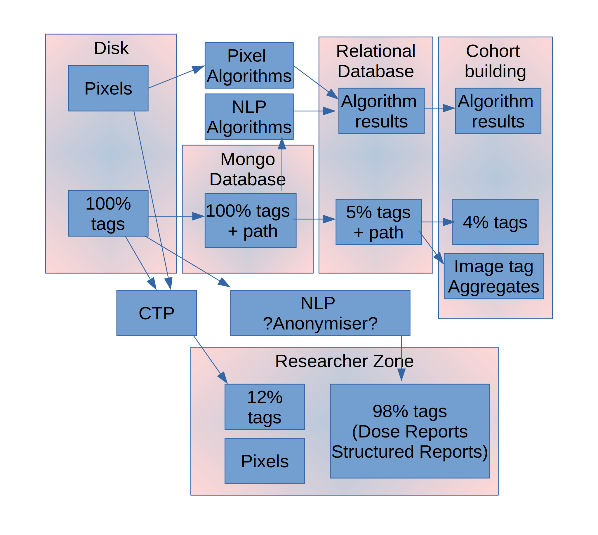

# Data Flow

## Background

This document describes the flow of DICOM tag and pixel data through the SmiServices system. This is an example deployment scenario, the actual implementation can be tailored according to needs.

Key

| Entity                     |                                                                                                                                                                                Purpose                                                                                                                                                                                |
| -------------------------- | :-------------------------------------------------------------------------------------------------------------------------------------------------------------------------------------------------------------------------------------------------------------------------------------------------------------------------------------------------------------------: |
| Disk                       |                                                                                                                                                          All original DICOM files are kept unchanged on disk                                                                                                                                                          |
| Mongo Database             |                                                                                                                                                     All DICOM tags (except pixel data) are stored in JSON format                                                                                                                                                      |
| Pixel Algorithms           |                                                                                                         Validated production ready algorithms run on identifiable dicom pixel data and output results useful for cohort building into the relational database                                                                                                         |
| NLP Algorithms             |                                                                                      Validated production ready algorithms run on identifiable free text data (e.g. Dose Reports, Structured Reports) and output results useful for cohort building into the relational database                                                                                      |
| Relational Database        |                                                                                                                                 Only tags useful for cohort building that are easily (and reliably) anonymised (e.g. 5% of all tags)                                                                                                                                  |
| Cohort building            |                                                                                                                                        Only tags useful for cohort building and only study/series level (e.g. 4% of all tags)                                                                                                                                         |
| Researcher Zone (from CTP) |                                                                               DICOM images with tags anonymised by CTP. These include technical tags (some of which are not loaded to Relational / used in cohort building), date tags, anonymised patient ID e.g. 12% of original tags                                                                               |
| Researcher Zone (from NLP) | DICOM files containing full clinical reports (e.g. Dose Reports, Structured Reports). These reports would need to be be anonymised with a dedicated NLP tool as free text report redacting is not something CTP is set up to do. A high proportion of the clinical report content would need to remain in these files for most free text research activities e.g. 98% |
