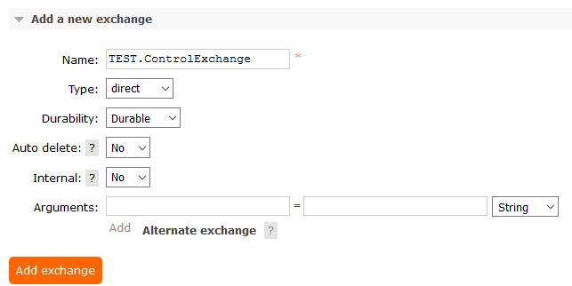
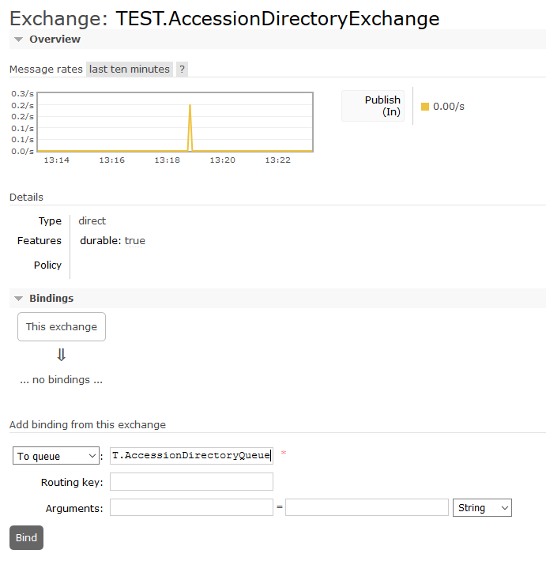
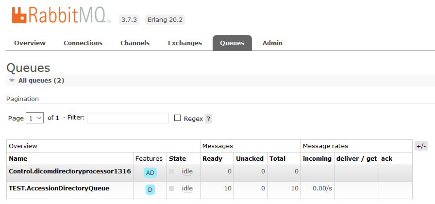
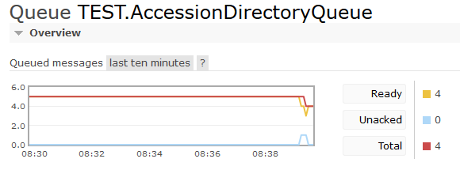
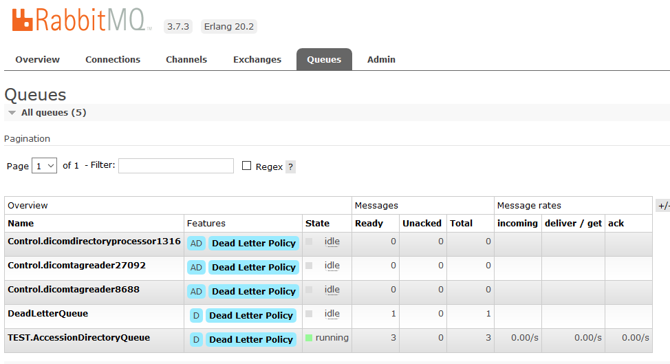
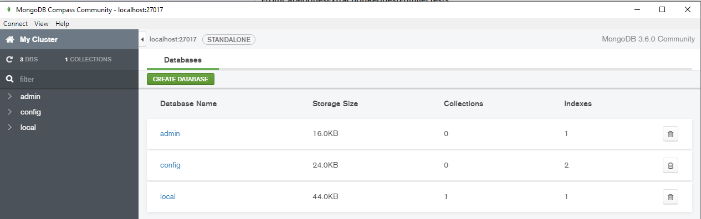

# Data Loading

## Contents

- [Background](#background)
  - [MongoDb]
  - [RelationalDb]
- [Preparation](#preparation)
  - [Publish Binaries](#publish-binaries)
- [MongoDb Loading Microservices](#mongodb-loading-microservices)
  - [DicomDirectoryProcessor](#dicomdirectoryprocessor)
  - [DicomTagReader](#dicomtagreader)
    - [Dead Letter Exchange](#dead-letter-exchange)
  - [DicomTagReader Continued](#dicomtagreader-continued)
  - [MongoDbPopulator](#mongodbpopulator)
- [RelationalDb Loading Microservices](#relationaldb-loading-microservices)
  - [DicomReprocessor](#dicomreprocessor)
  
 
## Background

This document describes all the steps required to setup data load microservices and use them to load a collection of Dicom images.

Microservices are designed to execute in parallel and scale to support hundreds of millions of dicom image files.

The data load process populates two databases:

 - Mongo Db (identifiable)
 - Relational Db (anonymous)

### MongoDb

The Mongo Db database stores all (non pixel) dicom tags and file paths for all dicom images.  It can be used for understanding what data you have (modalities, date ranges, image types etc) and serves as the input source for the subsequent relational database.

MongoDb is used because it is designed to store wide (many columns) and tree structures (e.g. dicom tags with the value representation SQ - sequence).

### RelationalDb

The Relational Db (e.g. Sql Server, MySql, Oracle or Postgres) stores only the tags required for cohort creation and image extraction (e.g. StudyDate, PatientID, Modality, StudyDescription etc).  The RelationalDb should only be loaded with images that are fit for release (can be anonymised) and only anonymised tags should be loaded (this includes performing identifier substitution e.g. for PatientID).

A relational database is used because it allows easier linking with other traditional EHR data (e.g. prescribing, biochemistry etc) held by a safehaven.


## Preparation

Download [BadDicom] and use it to generate some test images on disk:

```
BadDicom.exe c:\temp\testdicoms
```


Ensure Mongo Db is running e.g.:

```
C:\Program Files\MongoDB\Server\3.6\bin> ./mongod
```

Ensure RabbitMQ is running e.g.:

```
C:\Program Files\RabbitMQ Server\rabbitmq_server-3.7.3\sbin> .\rabbitmq-server.bat start
```

Ensure the target DBMS is running e.g.:

```
E:\mysql-5.7.19-winx64\bin> ./mysqld
```

Delete all RabbitMQ exchanges and queues:

```
http://127.0.0.1:15672/#/queues
```

Follow instructions listed in https://stackoverflow.com/a/52002145/4824531

### Publish Binaries

For each microservice run `dotnet publish -r win-x64` e.g.

```
E:\SmiServices\src\applications\Applications.DicomDirectoryProcessor> dotnet publish -r win-x64
```


## MongoDb Loading Microservices

The following process are responsible for loading the [MongoDb] with

### DicomDirectoryProcessor

Run `DicomDirectoryProcessor` with the directory you created test dicom files in e.g.:

```
E:\SmiServices\src\applications\Applications.DicomDirectoryProcessor\bin\AnyCPU\Debug\netcoreapp2.2\win-x64> .\DicomDirectoryProcessor.exe -d C:\temp\testdicoms
```

This may cause the following error:

```
Failed to construct host:
System.IO.FileNotFoundException: Could not find the logging configuration in the current directory (Smi.NLog.config),
```

Copy and modify (if needed) [Smi.NLog.config] to the binary directory


Run the application again, this time you should see:

```
Failed to construct host:
System.ApplicationException: The given control exchange was not found on the server: "TEST.ControlExchange"
```

Create the exchange:

---



---

This is the exchange by which you can send runtime messages (e.g. shutdown) to the service

Now when it is run you will see an error relating to another missing exchange (probably `TEST.AccessionDirectoryExchange`)

Create the following exchanges:

- TEST.AccessionDirectoryExchange
- TEST.FatalLoggingExchange

Now when running you should see an error:

```
2019-12-02 13:18:50.6045|FATAL|DicomDirectoryProcessorHost|Could not confirm message published after timeout|System.ApplicationException: Could not confirm message published after timeout
```

This is because there is no queue associated with the output exchange.  Create a queue `TEST.AccessionDirectoryQueue`

---


---
Bind the `TEST.AccessionDirectoryExchange` exchange with the queue `TEST.AccessionDirectoryQueue`:

---



---

Once you have done this you should see output from the program like:

```
PS E:\SmiServices\src\applications\Applications.DicomDirectoryProcessor\bin\AnyCPU\Debug\netcoreapp2.2\win-x64> .\DicomDirectoryProcessor.exe -d C:\temp\testdicoms
Bootstrapper -> Main called, constructing host
2019-12-02 13:25:45.6886| INFO|DicomDirectoryProcessorHost|Host logger created with SMI logging config|||
2019-12-02 13:25:45.7365| INFO|DicomDirectoryProcessorHost|Started DicomDirectoryProcessor:5468|||
2019-12-02 13:25:45.8932| INFO|DicomDirectoryProcessorHost|Creating basic directory finder|||
Bootstrapper -> Host constructed, starting aux connections
Bootstrapper -> Host aux connections started, calling Start()
2019-12-02 13:25:45.9435| INFO|BasicDicomDirectoryFinder|Starting directory scan of: C:\temp\testdicoms|||
2019-12-02 13:25:46.1277| INFO|BasicDicomDirectoryFinder|Directory scan finished|||
2019-12-02 13:25:46.1277| INFO|BasicDicomDirectoryFinder|Total messages sent: 10|||
2019-12-02 13:25:46.1277| INFO|BasicDicomDirectoryFinder|Largest stack size was: 10|||
2019-12-02 13:25:46.1277| INFO|BasicDicomDirectoryFinder|Averages:
NewDirInfo:     0ms
EnumFiles:      0ms
FirstOrDef:     0ms
FoundNewDir:    17ms
EnumDirs:       0ms
PushDirs:       0ms
|||
2019-12-02 13:25:46.1277| INFO|DicomDirectoryProcessorHost|Host Stop called: Directory scan completed|||
2019-12-02 13:25:46.4812| INFO|DicomDirectoryProcessorHost|Host stop completed|||
Bootstrapper -> Host started
Bootstrapper -> Exiting main
```

There should be 1 message per folder in the your test dicoms directory:

---



---

If you use GetMessages in the rabbit MQ interface you can see what was the messages contain:

---


---

Thats right, all this work was just to get a __directory listing__ into RabbitMQ! But now that you have the basics of creating exchanges / queues down it should be much easier to get the rest of the services running (see below).

To change the exchange/queue names you should edit `default.yaml` (ensuring your RabbitMQ server has the correct entries)

### DicomTagReader

Publish and run DicomTagReader (copy across [Smi.NLog.config] if needed) e.g.:

```
E:\SmiServices\src\microservices\Microservices.DicomTagReader\bin\AnyCPU\Debug\netcoreapp2.2\win-x64> ./DicomTagReader.exe
```

This should result in an error about `TEST.IdentifiableSeriesExchange`.  Create the following exchanges:

- TEST.IdentifiableSeriesExchange
- TEST.IdentifiableImageExchange

This should cause our old friend:

```
Could not confirm message published after timeout
```

Notice also that a queue message has still been consumed and we have 1 less message in the `TEST.AccessionDirectoryQueue`

---



_RabbitMQ queue graph are 1 less message available for processing_

---

Messages that cannot be processed are 'nacked' and not returned to the processing queue.  This prevents 'bad' messages getting served up repeatedly to consumers and degrading system performance.  To prevent message loss we can set up a dead letter exchange.


#### Dead Letter Exchange

Create an internal exchange and queue for the dead letters:

- DeadLetterExchange
  - DeadLetterQueue

Now create a policy for all queues to send nacked messages to this exchange:

---


---

Run DicomTagReader again to force another failure (because we still have no bound output queue for our succesfully processed messages)

This should result in the 'lost' message being sent to the dead letter queue:

---



_The unprocessed message now resides in the dead letter queue_

---

### DicomTagReader Continued

Create the output queues for the tag reader exchanges (make sure to bind them to the correct exchanges):

- TEST.IdentifiableSeriesExchange
  - TEST.IdentifiableSeriesQueue
- TEST.IdentifiableImageExchange
  - TEST.IdentifiableImageQueue

This should produce the following output:

```
Bootstrapper -> Main called, constructing host
2019-12-03 09:09:42.1992| INFO|DicomTagReaderHost|Host logger created with SMI logging config|||
2019-12-03 09:09:42.2524| INFO|DicomTagReaderHost|Started DicomTagReader:17464|||
Bootstrapper -> Host constructed, starting aux connections
2019-12-03 09:09:42.5133| INFO|SerialTagReader|Stopwatch implementation - IsHighResolution: True. Frequency: 10000000 ticks/s|||
Bootstrapper -> Host aux connections started, calling Start()
Bootstrapper -> Host started
Bootstrapper -> Exiting main
2019-12-03 09:09:43.2117| INFO|SerialTagReader|Sending 8 DicomFileMessage(s)|||
2019-12-03 09:09:43.2553| INFO|SerialTagReader|Sending 2 SeriesMessage(s)|||
2019-12-03 09:09:43.3095| INFO|SerialTagReader|Sending 8 DicomFileMessage(s)|||
2019-12-03 09:09:43.3353| INFO|SerialTagReader|Sending 2 SeriesMessage(s)|||
2019-12-03 09:09:43.4184| INFO|SerialTagReader|Sending 8 DicomFileMessage(s)|||
2019-12-03 09:09:43.4330| INFO|SerialTagReader|Sending 2 SeriesMessage(s)|||
```

The binary will not exit by default (it will wait for more messages).  Use Ctrl+C to trigger shutdown of the binary.

```
2019-12-03 09:10:59.0453| INFO|SerialTagReader|Lock released, no more messages will be processed|||
2019-12-03 09:10:59.0453| INFO|SerialTagReader|Average rates - enumerate dir (per acc. message): 0.001034s, file process: 0.002731s, send messages: 0.003534s, overall: 0.211906s|||
2019-12-03 09:10:59.0453| INFO|DicomTagReaderHost|Host Stop called: Ctrl+C pressed|||
2019-12-03 09:10:59.5284| INFO|DicomTagReaderHost|Host stop completed|||
```

After execution the queues should look like:

---


_Output queues from a succesful run of DicomTagReader_

---

If you peek at the messages in the `TEST.IdentifiableImageExchange`.  You should see the JSON representation of a dicom image (tags only - no pixel data):

```
Exchange 	TEST.IdentifiableImageExchange
timestamp:	1575364183
delivery_mode:	2
headers:	
MessageGuid:	a5f2ad28-6f87-49b6-b417-e87c425d74c1
OriginalPublishTimestamp:	1575293146
Parents:	90429bb7-5650-4ea0-922e-082cfc7befcc
ProducerExecutableName:	DicomTagReader
ProducerProcessID:	17464
content_encoding:	UTF-8
content_type:	application/json
Payload
2802 bytes
Encoding: string
	
{"NationalPACSAccessionNumber":"6","DicomFilePath":"testdicoms\\1987\\12\\6\\2.25.176347174691273338913144606255096043339.dcm","StudyInstanceUID":"2.25.124865355268738178415667314856224778478","SeriesInstanceUID":"2.25.268908360241165259234396963267293474168","SOPInstanceUID":"2.25.176347174691273338913144606255096043339","DicomDataset":"{\"00080008\":{\"vr\":\"CS\",\"val\":\"ORIGINAL\\\\PRIMARY\\\\AXIAL\"},\"00080016\":{\"vr\":\"UI\",\"val\":\"1.2.840.10008.5.1.4.1.1.7\"},\"00080018\":{\"vr\":\"UI\",\"val\":\"2.25.176347174691273338913144606255096043339\"},\"00080020\":{\"vr\":\"DA\",\"val\":\"19871206\"},\"00080021\":{\"vr\":\"DA\",\"val\":\"19871206\"},\"00080022\":{\"vr\":\"DA\",\"val\":\"19871206\"},\"00080030\":{\"vr\":\"TM\",\"val\":\"180631\"},\"00080031\":{\"vr\":\"TM\",\"val\":\"180631\"},\"00080032\":{\"vr\":\"TM\",\"val\":\"180631\"},\"00080060\":{\"vr\":\"CS\",\"val\":\"CT\"},\"00080061\":{\"vr\":\"CS\",\"val\":\"CT\"},\"00081030\":{\"vr\":\"LO\",\"val\":\"CT Thorax & abdo & pel\"},\"00100010\":{\"vr\":\"PN\",\"val\":\"LUCA Price\"},\"00100020\":{\"vr\":\"LO\",\"val\":\"3003863640\"},\"00100030\":{\"vr\":\"DA\",\"val\":\"19860330\"},\"00101010\":{\"vr\":\"AS\",\"val\":\"001Y\"},\"00101040\":{\"vr\":\"LO\",\"val\":\"76 Foggyley Place Brechin and Edzell Angus DD9 6ES\"},\"00180050\":{\"vr\":\"DS\"},\"00180060\":{\"vr\":\"DS\",\"val\":\"0\"},\"00180088\":{\"vr\":\"DS\"},\"00181149\":{\"vr\":\"IS\",\"val\":\"0\"},\"00181150\":{\"vr\":\"IS\",\"val\":\"0\"},\"00181151\":{\"vr\":\"IS\",\"val\":\"0\"},\"00181152\":{\"vr\":\"IS\",\"val\":\"0\"},\"00189311\":{\"vr\":\"FD\",\"val\":[0.0]},\"00189461\":{\"vr\":\"FL\",\"val\":[0.0]},\"0020000D\":{\"vr\":\"UI\",\"val\":\"2.25.124865355268738178415667314856224778478\"},\"0020000E\":{\"vr\":\"UI\",\"val\":\"2.25.268908360241165259234396963267293474168\"},\"00200011\":{\"vr\":\"IS\",\"val\":\"0\"},\"00200012\":{\"vr\":\"IS\",\"val\":\"0\"},\"00200032\":{\"vr\":\"DS\",\"val\":\"0\\\\0\\\\0\"},\"00201041\":{\"vr\":\"DS\"},\"00201208\":{\"vr\":\"IS\",\"val\":\"2\"},\"00201209\":{\"vr\":\"IS\",\"val\":\"4\"},\"00280002\":{\"vr\":\"US\",\"val\":[3]},\"00280004\":{\"vr\":\"CS\"},\"00280006\":{\"vr\":\"US\",\"val\":[0]},\"00280008\":{\"vr\":\"IS\",\"val\":\"1\"},\"00280010\":{\"vr\":\"US\",\"val\":[500]},\"00280011\":{\"vr\":\"US\",\"val\":[500]},\"00280030\":{\"vr\":\"DS\",\"val\":\"0.3\\\\0.25\"},\"00280100\":{\"vr\":\"US\",\"val\":[8]},\"00280101\":{\"vr\":\"US\",\"val\":[8]},\"00280102\":{\"vr\":\"US\",\"val\":[7]},\"00280103\":{\"vr\":\"US\",\"val\":[0]},\"00280301\":{\"vr\":\"CS\",\"val\":\"NO\"},\"00282110\":{\"vr\":\"CS\",\"val\":\"00\"},\"00282112\":{\"vr\":\"DS\",\"val\":\"1\"},\"00282114\":{\"vr\":\"CS\",\"val\":\"ISO_10918_1\"},\"00400253\":{\"vr\":\"SH\",\"val\":\"0\"},\"7FE00010\":{\"vr\":\"OB\"}}"}
```

_A JSON serialized dicom dataset in RabbitMQ (this is __synthetic test data__ made up by the [BadDicom] tool)_

### MongoDbPopulator

The next microservice is responsible for persisting the dicom tag data into a MongoDb database.

Install and launch MongoDb Compas e.g.:

```
C:\Users\tznind\AppData\Local\MongoDBCompassCommunity\MongoDBCompassCommunity.exe
```

Your MongoDb instance should be blank (contain no imaging datasets at least):




Publish and run `MongoDbPopulator` (making sure to copy accross [Smi.NLog.config] if required)

```
E:\SmiServices\src\microservices\Microservices.MongoDbPopulator\bin\AnyCPU\Debug\netcoreapp2.2\win-x64> .\MongoDbPopulator.exe
```

This should give the following error `Expected queue "TEST.MongoSeriesQueue" to exist`.

MongoDbPopulator is designed to read the outputs from `DicomTagReader` but these outputs can also be forked to the relational database loading services to load both databases simultaneously.  For now lets stick with loading MongoDb only (we can always start RelationalDb loading from mongo collections anyway).

Open `default.yaml` in the exe directory of MongoDbPopulator and set the `QueueName` entries under `MongoDbPopulatorOptions` to `TEST.IdentifiableSeriesQueue` and `TEST.IdentifiableImageQueue`

```yaml
MongoDbPopulatorOptions:
    SeriesQueueConsumerOptions:
        QueueName: 'TEST.IdentifiableSeriesQueue'
        QoSPrefetchCount: 1000
        AutoAck: false
    ImageQueueConsumerOptions:
        QueueName: 'TEST.IdentifiableImageQueue'
        QoSPrefetchCount: 10000
        AutoAck: false
    MongoDbFlushTime: 30 # Seconds
    FailedWriteLimit: 5
```

_The MongoDbPopulator section of default.yaml should now look like this_

Run `MongoDbPopulator` again.  It should result in the following:

```
Bootstrapper -> Main called, constructing host
2019-12-03 10:32:40.4703| INFO|MongoDbPopulatorHost|Host logger created with SMI logging config|||
2019-12-03 10:32:40.5180| INFO|MongoDbPopulatorHost|Started MongoDbPopulator:7616|||
Bootstrapper -> Host constructed, starting aux connections
Bootstrapper -> Host aux connections started, calling Start()
2019-12-03 10:32:41.1959| INFO|MongoDbPopulatorHost|Starting consumers|||
Bootstrapper -> Host started
Bootstrapper -> Exiting main
2019-12-03 10:32:41.2108| INFO|MongoDbPopulatorHost|Consumers successfully started|||
2019-12-03 10:33:11.1579| INFO|Microservices.MongoDBPopulator.Execution.MongoDbAdapter|Attempting bulk write of 6 documents to dicom.series|||
2019-12-03 10:33:11.1579| INFO|ImageMessageProcessor|Queue contains 24 message to write|||
2019-12-03 10:33:11.1838| INFO|Microservices.MongoDBPopulator.Execution.MongoDbAdapter|Attempting bulk write of 24 documents to dicom.image_CT|||
```

Your MongoDb instance should now have 2 new collections `image_CT` and `series`.  The queues should also be fully drained of messages.


_Mongo Db after MongoDbPopulator has run_

## RelationalDb Loading Microservices

The following microservices are responsible for loading the [RelationalDb] with anonymised tag data (and file paths) for downstream cohort creation, linkage and extraction processes.

### DicomReprocessor

This application is responsible for fetching records from [MongoDb] collections and queuing them for processing in RabbitMQ.

Publish and run `DicomReprocessor` (making sure to copy accross [Smi.NLog.config] if required)

```
E:\SmiServices\src\microservices\Microservices.DicomReprocessor\bin\AnyCPU\Debug\netcoreapp2.2\win-x64> .\DicomReprocessor.exe
```

This should display the following helpful prompt:

```
ERROR(S):
  Required option 'c, collection-name' is missing.
USAGE:
Normal Scenario:
  DicomReprocessor --batch-size 123 --collection-name image
```

Add the missing parameters e.g.

```
todo
```

[Smi.NLog.config]: ../data/logging/Smi.NLog.config
[BadDicom]: https://github.com/HicServices/BadMedicine.Dicom/releases
[MongoDb]: #mongodb
[RelationalDb]: #relationaldb