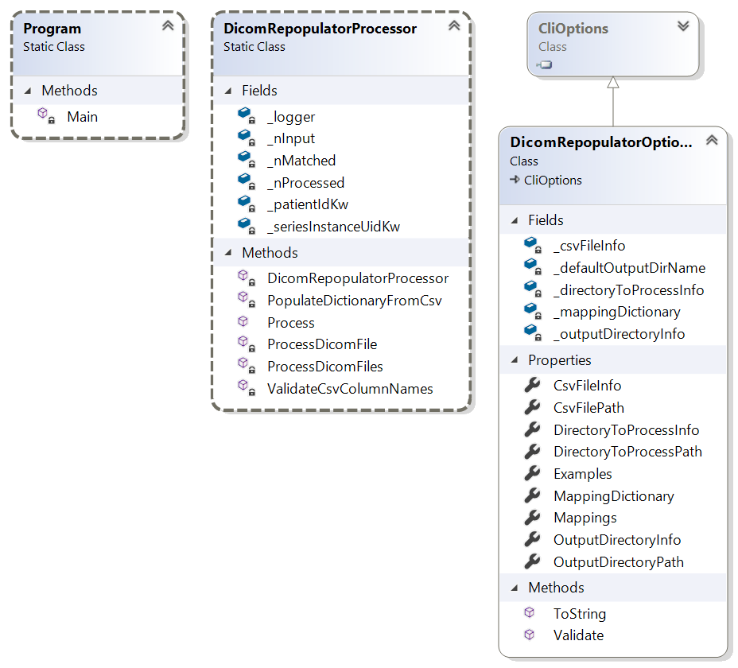

# Dicom Repopulator
Primary Author: [Ruairidh MacLeod](https://github.com/Ruairidh)
## Contents
 1. [Overview](#1-overview)
 2. [Setup / Installation](#2-setup--installation)
 3. [Exchange and Queue Settings](#3-exchange-and-queue-settings)
 4. [Config](#4-config)
 5. [Expectations](#5-expectations)
 6. [Example command line](#6-example-command-line)
 7. [Class Diagram](#7-class-diagram)

### 1. Overview
Standalone CLI program to repopulate dicom files with tag data from a csv file.

#### Input csv format 
The CSV file must use commas to separate the data files and must have a single header row that specifies column names.

#### Input directory
The program will scan for any dicom files in the input directory, as well as searching subdirectories. The output directory structure will match the input.

#### Output files
Input files will be loaded in, have their content replaced, and then copied and saved to a new directory either as specified in the options, or in the default `defaultOut` directory. The output directory must either not already exist or be empty.

#### Key
The key is used to determine which row of the CSV data should be used for any particular Dicom file.  The row will be the one for which the value in the key column of the CSV file matches the value in the key field of the Dicom file.  The key is specified in the format `CsvColumnName:DicomTagName`, for example `id:SeriesInstanceUID`. Dicom tag names must be full dictionary names of dicom tags  (can be searched for [here](https://dicom.innolitics.com/ciods) if unsure).

#### Mappings
Specifies mappings between CSV column names and Dicom Tag names. A mapping has the format `CsvColumnName:DicomTagName`, for example `date:StudyDate`. Dicom tag names must be full dictionary names of dicom tags  (can be searched for [here](https://dicom.innolitics.com/ciods) if unsure).  

It is possible to specify multiple mappings and the same csv column can map to multiple Dicom tags.  For example:

`id:PatientId id:PatientName date:StudyData date:SeriesDate`

### 2. Setup / Installation
  - Clone the project and build. Any NuGet dependencies should be automatically downloaded
  - Edit the default.yaml with the configuration for your environment

### 3. Exchange and Queue Settings
N/A - this is a CLI tool only.

### 4. Config
No config options in the yaml files, operation only depends on the CLI arguments:

| Command Line Options | Switch | Required |  Purpose |
| ------------- | ------------- | ------------- | ------------- |
|Input file | -i, --input-csv| Yes| Csv file to read data from |
|Input directory | -d, --input-directory| Yes| Directory to search for dicom files |
|Output directory| -o, --output-directory| No|Defaults to `defaultOut\` if not specified|
|Key| -k, --key| Yes|Specifies the key column in the CVS file and the corresponding Dicom tag|
|Mappings| -m, --mappings| Yes|Specifies the mappings between CSV columns and Dicom tags|
|Number of threads| -t, --threads| No |Specifies the number of threads to use (default 4)|

### 5. Expectations
Errors are [logged as normal for a MicroserviceHost](../Microservices.Common/README.md#logging)
N.b. The tool does not talk to RabbitMQ at all, so crashes will not be reported in the `FatalLoggingExchange`

### 6. Example command line
```
DicomRepopulator.exe 
  -d C:\Project45\DicomImages 
  -o C:\Project45\DicomImagesOut 
  -i C:\Project45\data.csv
  -k seriesID:SeriesInstanceUID
  -m id:PatientID id:PatientName date:StudyDate date:SeriesDate 
```

### 7. Class Diagram


