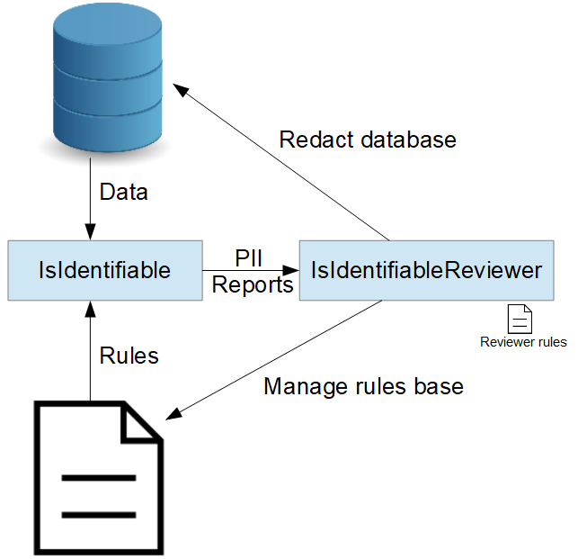
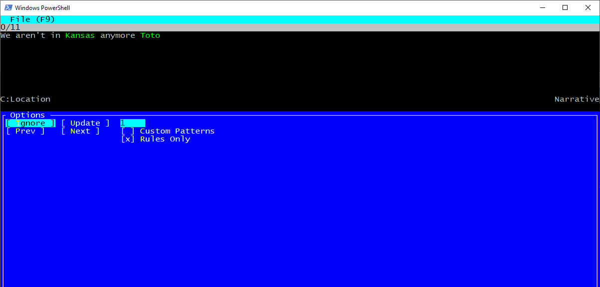
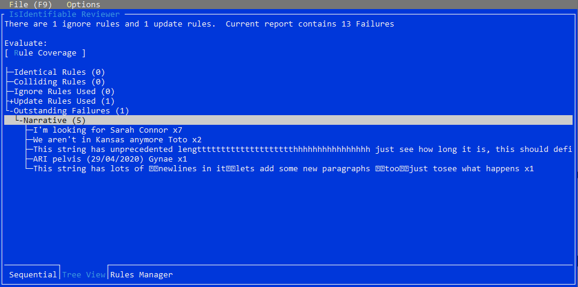
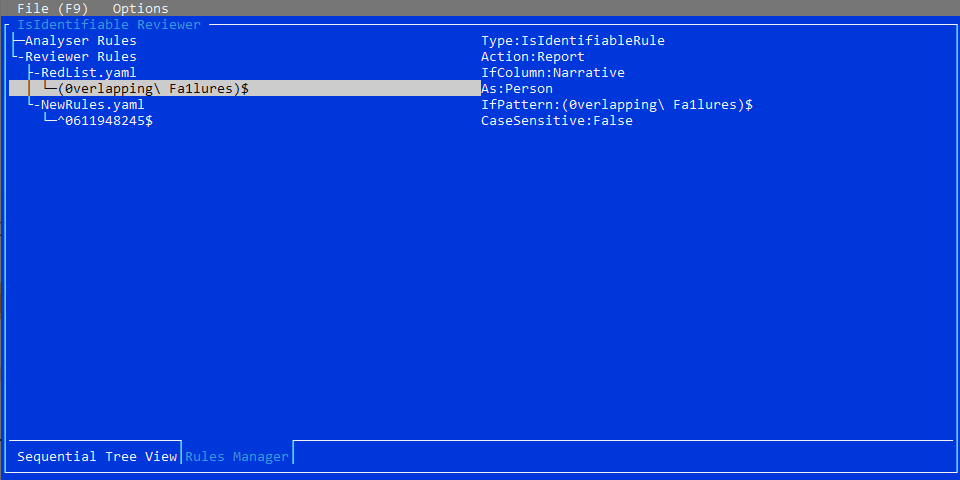

# IsIdentifiable Reviewer

Primary Author: [Thomas](https://github.com/tznind)

## Contents

1.  [Overview](#1-overview)
2.  [Setup / Installation](#2-setup--installation)
3.  [Usage](#3-usage)
    1. [Reviewing the output of IsIdentifiable]
    2. [Redacting the database]
    3. [Managing the rulebase]

## 1. Overview

Is Identifiable Reviewer is a cross platform text based UI for managing the anonymisation processes in which [PII] is detected and removed. It serves as a management console for the
rulesbase of [IsIdentifiable] and as a downstream process for validating the results/redacting the database.


_The review process of potentially PII_

There are 3 activities that can be undertaken using the reviewer:

-   [Reviewing the output of IsIdentifiable]
-   [Redacting the database]
-   [Managing the rulebase]

## 2. Setup / Installation

The application runs as a sub verb of `smi` (See [SmiRunner]). You can see the application help by running:

```
.\smi is-identifiable-reviewer --help
```

The following parts of the global yaml config file interact with this tool:

| YAML Section                        | Purpose                                                                                                                       |
| ----------------------------------- | ----------------------------------------------------------------------------------------------------------------------------- |
| IsIdentifiableOptions               | What files/directories to find the current rulesbase for the [IsIdentifiable] process. This used when [Managing the rulebase] |
| IsIdentifiableReviewerGlobalOptions |                                                                                                                               |

| Command Line Options          | Purpose                                                                                                          |
| ----------------------------- | ---------------------------------------------------------------------------------------------------------------- |
| IsIdentifiableReviewerOptions | Allows overriding of which yaml file is loaded and runtime arguments e.g. which table to redact / report to load |

## 3. Usage

### Reviewing the output of IsIdentifiable

The IsIdentifiable tool applies NLP and the rules base to identify [PII] data in the database. A sample output file is included: [ExampleReport](./ExampleReport.csv) is included.

Open the report using the `-f somefile.csv` command line option or `File->Open Report`.

Once loaded you can iterate the reports sequentially using the 'Sequential' tab or get an overview of all the issues encountered (aggregated by frequency) in the 'Tree View' tab.


_Sequential View_

The 'Sequential' view operates on one failure at a time. It shows the full string at the top, with the failures highlighted in green. At the bottom left is the classification of the failure: Person, Organisation, Date, etc. At the bottom right is the column (or DICOM tag) where the failure was found. It is important to check this column because, for example, you should Ignore a hospital name if the column is InstitutionName, but Update it if the column is StudyDescription.

The `Next` and `Prev` buttons move sequentially through the failures, i.e. `Next` does not skip over failures that are matched by existing rules.


_'Tree View' showing PII detected aggregated by unique failing value and column where PII was found_

The 'Tree View' sorts all of the failures by number of occurrences. This tree view shows all the categories of rules and then all the categories of failures. It also shows the list of Conflicting rules which is where a failure matches both an Ignore and an Update rule.

Each instance of potential [PII] found by IsIdentifiable is termed a 'failure' (the existing anonymisation process has failed to strip this PII). A 'failure' can be either a false positive or a genuine case of [PII]. Make a decision for each failure whether to ignore it or 'report' it.

#### Report/Ignore

Review the reports and mark either `Ignore` (this is a false positive) or `Update` (this is PII and needs to be redacted). This will result in a new rule being added to either `NewRules.yaml` (Ignore) or `RedList.yaml` (Update). Once a rule is written it will be applied automatically to future reports loaded eliminating the lead to make duplicate decisions. After using `Ignore` or `Update` the display moves onto the next failure, skipping over those which are matched by existing rules.

Conceptually these rules are slightly different from the IsIdentifiable rules. IsIdentifiable first uses rules to spot known PII. Then it uses a NLP(NER) tool which attempts to find more PII. Finally it uses whitelist rules to ignore known false positives. Ideally these rules should be fine-tuned to reduce the work of the reviewer so, for example, if the reviewer shows 90% of failures are due to `Manufacturer=AGFA` it would be wise to manually edit IsIdentifiable rules. The Reviewer rules are different in that they are used filter the IsIdentifiable output and either ignore or redact its failure reports. The syntax of the rules files looks similar but is used differently, and has no effect on future runs of IsIdentifiable, only on future Reviews.

The menu `Options | Custom Patterns` menu, when ticked, will provide the opportunity to edit the Ignore/Update rule before it is saved. This allows you to make fine adjustments to the exact pattern which will be redacted. Note that all bracketed patterns are redacted so you can add (or remove) any as necessary. For example, if the full string is `John Smith Hospital^MRI Head^(20/11/2020)` but only the date has been detected you could still redact the hospital name as well by editing the pattern to be `(John Smith Hospital)^.*^\((\d\d/\d\d/\d\d\d\d)\)$` (i.e. adding the name in brackets).

The Custom Patterns window provides several options to edit the pattern:

-   `x` - clears currently typed pattern
-   `F` - creates a regex pattern that matches the full input value
-   `G` - creates a regex pattern that matches only the failing part(s)
-   `\d` - replaces all digits with regex wildcards
-   `\c` - replaces all characters with regex wildcards
-   `\d\c` - replaces all digits and characters with regex wildcards

### Redacting the database

Once all 'failures' in a report have been processed and either ignored or a 'report' rule generated you can redact the database. This is done by running the application using the `-u` and `-t` flags.

Since you may have several servers / databases that are processed using this tool, it is necessary to indicate where UPDATE commands should be run. This is done by putting the connection string in a 'targets' file:

```yaml
- Name: My Server
  ConnectionString: Server=localhost;Username=root;Password=zombie
  DatabaseType: MySql
```

_Example targets file_

The following flags should be combined to successfully redact the database:

| Flag | Example                 | Purpose                                                                                                                                                                                                                                                                                   |
| ---- | ----------------------- | ----------------------------------------------------------------------------------------------------------------------------------------------------------------------------------------------------------------------------------------------------------------------------------------- |
| -f   | -f ./ExampleReport.csv  | Indicates which [IsIdentifiable] output report to redact. You must have completed the [review process] for this report                                                                                                                                                                    |
| -u   | -u ./misses.csv         | Indicates that you want to update the database. The file value must be included and is where reports that are not covered by rules generated in the [review process] are output. If you have completed the [review process] correctly this file should be empty after execution completes |
| -t   | -t z:\temp\targets.yaml | Path to a file containing the connection string (and DMBS type) of the relational database server that has the table requiring redaction                                                                                                                                                  |

```bash
smi.exe is-identifiable-reviewer -f ./ExampleReport.csv -u ./misses.csv -t z:\temp\targets.yaml
```

_Example redaction command_

### Managing the rulebase

Over time the number of rules in [IsIdentifiable] and the reviewer will increase. It can be beneficial to move ignore rules upstream from the reviewer to the [IsIdentifiable] rulebase especially for commonly encountered reports. This will reduce the number of false positives and the size of report files.

The 'Rules Manager' tab provides visualisation and control over the rules used by the [IsIdentifiable] tool ('Analyser Rules') and the Reviewer ('Reviewer Rules'). You should periodically review the rules base to ensure there are no mistakes and to identify candidates for pushing upstream into the analyser.


_Rules Manager View_

| Key        | Function                                                     |
| ---------- | ------------------------------------------------------------ |
| `<Delete>` | Removes a rule from the rulesbase                            |
| `<Enter>`  | Opens menu (if any) for interacting with rule(s) highlighted |

[isidentifiable]: ../../microservices/Microservices.IsIdentifiable/README.md
[pii]: https://en.wikipedia.org/wiki/Personal_data
[smirunner]: ../Applications.SmiRunner/
[managing the rulebase]: #managing-the-rulebase
[review process]: #reviewing-the-output-of-IsIdentifiable
[reviewing the output of isidentifiable]: #reviewing-the-output-of-isidentifiable
[redacting the database]: #redacting-the-database
