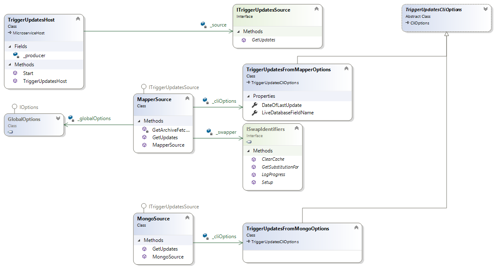

# TriggerUpdates

Primary Author: [Thomas Nind](https://github.com/tznind)

## Contents
 1. [Overview](#1-overview)
 2. [Setup / Installation](#2-setup--installation)
 3. [Exchange and Queue Settings](#3-exchange-and-queue-settings)
 4. [Config](#4-config)
 5. [Expectations](#5-expectations)
 6. [Class Diagram](#6-class-diagram)
 7. [Directory Scan Modes](#7-directory-scan-modes)

### 1. Overview
The TriggerUpdates app is a console app that runs and terminates rather than a microservice that runs forever. The app issues update messages designed for consumption by the [UpdateValues microservice] .

This application uses the verb system e.g. `./TriggerUpdates mapper` or `./TriggerUpdates mongo`.

### 2. Setup / Installation
 - Clone the project and build. Any NuGet dependencies should be automatically downloaded
 - Edit the yaml.default with the configuration for your environment
 - Run `TriggerUpdates.exe mapper -d <somedate> -f PatientID` from a commandline to issue messages for updating the live database(s) with changed mappings.

### 3. Exchange and Queue Settings
| Read/Write | Type | Config setting |
| ------------- | ------------- |------------- |
| Write | `UpdateValuesMessage` | `TriggerUpdatesOptions` |

### 4. Config
| YAML Section  | Purpose |
| ------------- | ------------- |
| RabbitOptions | Describes the location of the rabbit server for sending messages to |
| IdentifierMapperOptions | Describes the location of the mapping table when using the `mapper` verb with this command. |
| TriggerUpdatesOptions | The exchange name that `UpdateValuesMessage` should be sent to when detecting updates |

Arguments vary by verb, use `./TriggerUpdates mapper --help` to see required arguments.

### 5. Expectations
Errors are [logged as normal for a MicroserviceHost](../../common/Smi.Common/README.md#logging)

### 6. Class Diagram

[UpdateValues microservice]: ../../microservices/Updating/Microservices.UpdateValues/README.md