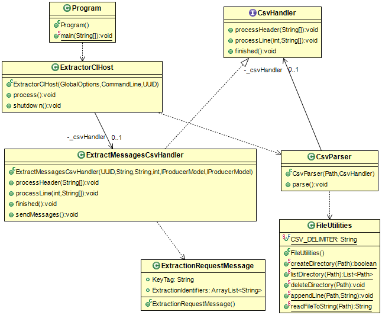

# ExtractorCL

Primary Author: [Ally Hume](https://github.com/allyhume)

## Contents

1.  [Overview](#1-overview)
2.  [Setup / Installation](#2-setup--installation)
3.  [Queue Settings](#3-exchange-and-queue-settings)
4.  [Config](#4-config)
5.  [Expectations](#5-expectations)
6.  [Class Diagram](#6-class-diagram)

### 1. Overview

The extract images command line app is used to trigger the process of extracting and anonymising images for release to researchers. The app expects to receive one or more CSV data files that contain a set of identifiers for the set of images to be extracted.

The CSV data files must contain a single column with a header. The header must exactly match one of the supported extraction identifiers: `StudyInstanceUID`, `SeriesInstanceUID`, or `SOPInstanceUID` (image ID), and the header must be consistent across the data files. If the header is `StudyInstanceUID`, then the extraction modality must also be provided on the commandline with `--modality=<...>`. The specified modality must exactly match the DicomTag name for an approved modality.

When run successfully the app will write out an extraction job identifier that can be used to track the extraction job through the rest of the system. It is expected that operators will write the ID into the email trace associated with the extraction task. For example:

```
Image extraction job started.  Job identifier: 17b731f7-73ef-4ee0-bd07-844e4819793b
```

If an error occurs during processing the system will typically write no messages to the messaging exchange. This allows users to fix the problem and try again without having to worry about cleaning up and job that started but cannot be finished.

### 2. Setup / Installation

- Clone the project and build. Any Maven dependencies should be automatically downloaded (see [here](https://github.com/SMI/SMIServices/blob/master/README.md##java-projects) for info on using Maven
- Edit the default.yaml with the configuration for your environment

### 3. Exchange and Queue Settings

| Read/Write | Type                         | Config setting                                            |
| ---------- | ---------------------------- | --------------------------------------------------------- |
| Write      | ExtractionRequestMessage     | `ExtractorClOptions.ExtractionRequestProducerOptions`     |
| Write      | ExtractionRequestInfoMessage | `ExtractorClOptions.ExtractionRequestInfoProducerOptions` |

The system will write two messages to the message exchanges. The first message is an ExtractionRequestMessage that contains details of identifiers of the series to be extracted. The app also writes an ExtractionRequestInfoMessage that contains the total number of series to be extracted by this job. This message allows for the app to write multiple ExtractionRequestMessage messages in the future should we consider that ExtractRequest messages are becoming too large for some projects.

### 4. Config

| YAML Section       | Purpose                                                              |
| ------------------ | -------------------------------------------------------------------- |
| RabbitOptions      | Describes the location of the rabbit server for sending messages to. |
| FileSystemOptions  | Describes the information about the filesystem to use                |
| ExtractorClOptions | Contains producer options for both of the queues to write to         |

| CLI Options         | Switch             | Required      | Purpose                                                                                    |
| ------------------- | ------------------ | ------------- | ------------------------------------------------------------------------------------------ |
| Yaml config         | -y, --yaml-file    | No            | Allows overriding of which yaml file is loaded.                                            |
| Proj. Identifier    | -p, --project      | Yes           | Identifier for the project, used in the extraction path\*                                  |
| Extraction dir.     | -e, --subdirectory | No            | Subdirectory of the ProjectDir to extract images into\*\*                                  |
| Extraction modality | -m, --modality     | Conditionally | The modality being extracted. Should only be specified if extracting by `StudyInstanceUID` |

\*The project identifier is the National Safe Haven project identifier (e.g. `1718-0316`).

\*\* This will default to the auto-generated GUID of the extraction job if not specified in the command line arguments.

### 5. Expectations

Errors are [logged as normal for a MicroserviceHost](../../../Microservices/Microservices.Common/README.md#logging)

N.b. Fatal Logging not set up for the Java services yet!

### 6. Class Diagram


