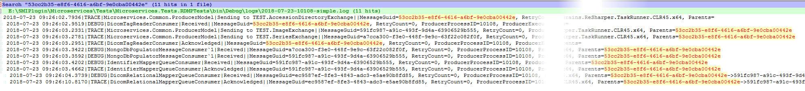
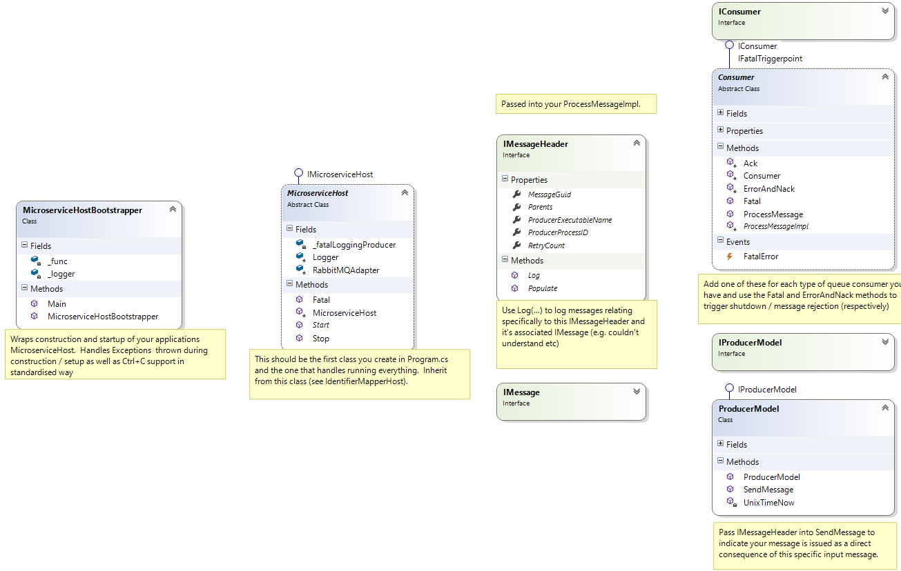

# Microservice Hosts

## Contents

-   [Implementing a Host](#implementing-a-host)
-   [Implementing a Consumer](#implementing-a-consumer)
-   [Logging](#logging)
-   [Rules of Microservice Club](#rules-of-microservice-club)
    -   [The First Rule](#the-first-rule)
    -   [The Second Rule](#the-second-rule)
-   [Class Diagram](#class-diagram)

## Implementing a Host

First load an instance of `GlobalOptions` in your `Program.cs`.
This is the base class for specifying all your configuration options.

```csharp
public class Program
{
    public static int Main(string[] args)
    {
        var options = new GlobalOptionsFactory().Load();

        // ...
    }
}
```

Next you need to decide which queues you want to read from and which you want to write to.
For this example let's assume you want to consume only from a single queue.
Your Consumer Options will be available from the GlobalOptions.
The `FatalLoggingProducerOptions` instance is created by the base host class.

```csharp
public class Program
{
    public static int Main(string[] args)
    {
        var options = new GlobalOptionsFactory().Load(); // will use the 'default.yaml' file

        var consumerOptions = options.MyHostOptions; // you don't really need this here...

        // ...
    }
}
```

For this to work you will need to update [default.yaml](../../../data/microserviceConfigs/default.yaml)

```yaml
# ... other stuff above

MyHostOptions: #you can also put this the following into a subclass to avoid cramming too many things at the root level
    QueueName: "MyQueueName"
    ConsumerTag: "MyQueueTag"
    QoSPrefetchCount: 1
    AutoAck: false
    # other options you may need
# ... other stuff below
```

If this is a brand new Host, also add the relevant bit into the `GlobalOptions`:

```csharp
public class GlobalOptions
{
    // SNIP LOTS OF CODE

    #region AllOptions

    // ... other stuff above
    public MyHostOptions? MyHostOptions { get; set; }

    #endregion
}

// new class for the new options
public class MyHostOptions : ConsumerOptions
{
    // other options go here. ConsumerOPtions are inherited.
}
```

Next create a derived class of `MicroserviceHost` this class should take all options needed to do it's job

```csharp
public class MyHost : MicroserviceHost
{
    private readonly ConsumerOptions _consumerOptions;

    public MyHost(GlobalOptions options, bool loadSmiLogConfig = true)
        : base(options, loadSmiLogConfig)
    {
        // Load all the options you need, do all the checks you need.
        _consumerOptions = options.MyHostOptions;
        //consumer = new MyConsumer(consumerOptions); //see next section for how to implement this
    }

    public override void Start()
    {
        RabbitMQAdapter.StartConsumer(_consumerOptions, consumer);
    }
}
```

Finally create an instance of `MicroserviceHostBootstrapper`.
This class will handle construction / connection issues during construction/startup of your `MicroserviceHost`.

```csharp
public class Program
{
    public static int Main(string[] args)
    {
        var options = new GlobalOptionsFactory().Load();

        var bootstrapper = new MicroserviceHostBootstrapper(
            () => new CohortPackagerHost(options));
        return bootstrapper.Main();
    }
}
```

### Expected Results

At this stage running the program is meaningful, it should give you sensible logs complaining about missing exchanges on your RabbitMQ Server.
You can now explore how to change (in the yaml file) / create these yourself.

When you have resolved the exchanges/queues you should get an error relating to `consumer` being null (we commented it out remember).
Proceed to the next section to see how to implement an `IConsumer`

## Implementing a Consumer

A consumer is a class which listens to a RabbitMQ queue and does something based on the messages that appear.
Create a new class derived from the `Consumer` abstract class.

```csharp
public class MyConsumer : Consumer
{
    // Add any parameters required
    public MyConsumer()
    {
        // Your constructor setup
    }

    protected override void ProcessMessageImpl(IMessageHeader? header, IModel model, BasicDeliverEventArgs basicDeliverEventArgs)
    {
        // Deserialize the message from the delivery arguments

        MyMessage message;
        if (!SafeDeserializeToMessage(header, deliverEventArgs, out message))
            return;

        // Do your work here, Ack or Nack depending on result

        if(success)
            Ack(header, deliverEventArgs);
        else
            ErrorAndNack(header, deliverEventArgs, message, exception)
    }
}
```

The `ProcessMessageImpl` method is where you will do your processing and must either `Ack` or `ErrorAndNack`.

The `IMessageHeader` contains provenance information about the message being dequeued. You can use it for logging (see below)
and must also supply it when producing new messages (this ensures the message audit chain is kept in tact).

## Logging

All microservices should be derived from the `MicroserviceHost` class, which ensures that a standard logging config is applied. The logging configuration is loaded from the NLog configuration file
specified in the `FileSystemOptions.LogConfigFile` config variable if it exists and is not an empty string, or otherwise from the file
`Smi.NLog.config` in the current directory. This configuration details how file based / console based logging happens and what levels are
processed / ignored etc.

This means that you can get a logger at any time by calling:

```csharp
var logger = NLog.LogManager.GetCurrentClassLogger();
```

The meaning of log levels (Trace, Debug, Info etc) are exactly as defined in the NLog standard:

https://github.com/NLog/NLog/wiki/Configuration-file#log-levels

The `Trace` logging level should be reserved for fine grained timing/performance code only - the lowest level for logging operational
messages should therefore be `Debug`. Trace logging will be disabled unless the CLI option `--trace-logging` is provided.

### Logging through the IMessageHeader

In addition to using the `Log` methods to log routine events, you can log message specific events via `IMessageHeader`:

```csharp
protected override void ProcessMessageImpl(IMessageHeader? header, IModel model, BasicDeliverEventArgs basicDeliverEventArgs)
{
    var logger = LogManager.GetCurrentClassLogger();
    header.Log(logger,LogLevel.Warn, "Message was all caps, had to call .Lower on it");
}
```

Logging through a header means that the Guid of the message (and the Guid all previous messages in the chain) will appear in the log e.g.


Logging through the header is recommended whenever the audited fact relates specifically to the content of the message (e.g. couldn't open a file referenced in a `DicomFileMessage`). Logging through the header automatically happens when sending and acknowledging messages, this results in a view of every message the system sent and the relationship tree of knock on messages (see image above).

## Rules of Microservice Club

### The First Rule

The first rule of Microservice Club is that `LogLevel.Fatal` means game over. Do not log to this level, instead you should call the `Fatal` method:

```csharp
protected override void ProcessMessageImpl(IMessageHeader? header, IModel model, BasicDeliverEventArgs basicDeliverEventArgs)
{
    var logger = LogManager.GetCurrentClassLogger();
    header.Log(logger,LogLevel.Warn, "Message was all caps, had to call .Lower on it");

    Fatal("Ran out of memory", new InsufficientMemoryException());

    //ErrorAndNack(header,model,basicDeliverEventArgs,"Something went wrong", new Exception("What went wrong"));
    Ack(header, model, basicDeliverEventArgs);
}
```

The Fatal method is in both `Consumer` and `MicroserviceHost` and causes the current Microservice to shutdown cleanly
and log a `FatalErrorMessage` to the RabbitMQ fatal message exchange (See `FatalLoggingProducerOptions`).

If your `ProcessMessageImpl` throws an unhandled Exception then a Fatal shutdown will automatically occur.

### The Second Rule

The second rule of Microservice Club is you don't nack messages without giving a reason. This is facilitated through the `Consumer.ErrorAndNack` method.  
This will log an error to NLog and Nack the message for you.

```csharp
protected override void ProcessMessageImpl(IMessageHeader? header, IModel model, BasicDeliverEventArgs basicDeliverEventArgs)
{
    ErrorAndNack(header,model,basicDeliverEventArgs,"Something went wrong", new Exception("What went wrong"));
}
```

## Class Diagram


