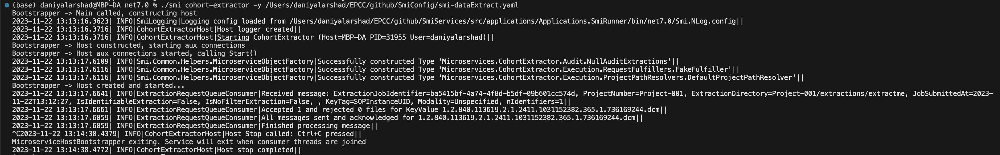
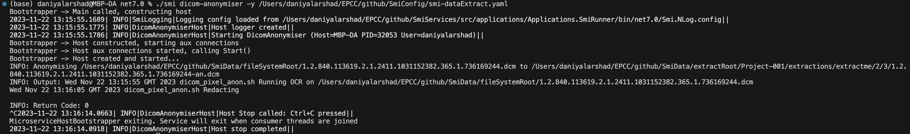
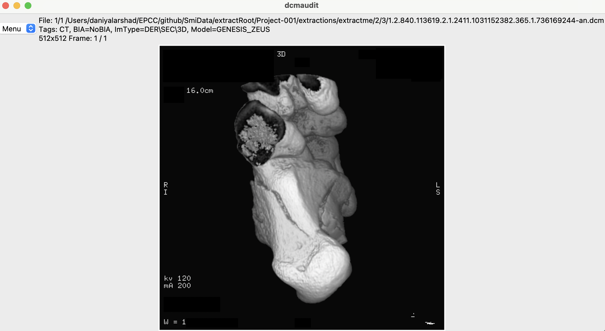

# Dicom Anonymiser (Microservice)

The dicom anonymiser also known as generic wrapper microservice streamlines the existing dicom processing workflow. It serves as a versatile tool capable of calling external programs to perform tasks such as anonymisation of [dicom tags](https://github.com/SMI/ctp-anon-cli), [pixel data](https://github.com/SMI/dicompixelanon) and/or [structured reports](https://github.com/SMI/StructuredReports) based on the dicom image modality.

One of the key strengths of this microservice lies in its ability to offer a unified interface for different types of external programs (for e.g., written in python or java), set configuration options, manage logging, and handle other environment variables. This flexibility allows the microservice to be easily integrated into the existing C# SmiServices architecture.

> Additional requirements which require further work _(i) Safe Haven Environment Testing_ and _(ii) Message Batching Mechanism (optional)_

## Getting Started

As of 1 June 2024, the dicom anonymiser microservice is functional (supports anonymisation of dicom tags, pixel data and structured reports), however, it is still in its infancy stage. To get started, ensure that the following programs/services are installed on your local machine in the same directory as the SmiServices repository:

1. [dicom tags anonymisation](https://github.com/SMI/dicompixelanon)
2. [dicom pixel anonymisation](https://github.com/SMI/ctp-anon-cli)
3. [structured reports anonymisation](https://github.com/SMI/StructuredReports)

Once these programs/services are installed, you will need to update the configuration file _default.yaml_ under `SmiServices/data/microserviceConfigs/` with the correct paths to the external programs. For example (see below):

```
// dicom tags anonymisation:
    CtpAnonCliJar: "path/to/ctp-anon-cli/ctp-anon-cli-0.5.0.jar"
    CtpAllowlistScript: "path/to/SmiServices/data/ctp/ctp-whitelist.script"

// dicom pixel anonymisation:
    VirtualEnvPath: "path/to/virtualenv/as/created/in/dicompixelanon"
    DicomPixelAnonPath: "path/to/dicompixelanon/src/applications/"

// structured reports anonymisation:
    SmiServicesPath: "path/to/SmiServices"
    SRAnonymiserToolPath: "path/to/StructuredReports/src/applications/SRAnonTool/CTP_SRAnonTool.sh"
```

The `Microservices.DicomAnonymiser/AnonymiserData/` directory contains the following subdirectories:

1. `sampleData/`: contains test dicom images (with SOPInstanceUID as their filename) to be anonymised.
2. `sampleScreenshots/`: contains screenshots from the dicom anonymiser microservice example workflow.
3. `sampleWorkflows/`: contains the extractRoot and fileSystemRoot subdirectories for testing purposes.

> Note: If you are using the extractRoot and fileSystemRoot directories within the `sampleWorkflow/` directory, ensure that the `default.yaml` configuration file is updated with the correct paths and that the sample dicom files are placed in the fileSystemRoot directory.

## Example Workflow

**1. Docker (Container)**

Initiate Essential Services (RabbitMQ, MSSQL, MongoDB, MariaDB, Redis)

```
git clone https://github.com/SMI/SmiServices.git
cd SmiServices/utils/docker-compose
docker-compose -f linux-dotnet-arm.yml up
```

**2. RDMP (Application)**

Setup RDMP (Github)

```
git clone git@github.com:HicServices/RDMP.git
cd RDMP/Tools/rdmp
dotnet clean
dotnet build
cd bin/Debug/net8.0
./rdmp install localhost RDMP_ -e -D -u sa -p "YourStrongPassw0rd"
```

Update Databases Connection (.yaml)

```
cd RDMP/Tools/rdmp
cat > Databases.yaml << EOF
CatalogueConnectionString: Server=localhost;Database=RDMP_Catalogue;User ID=sa;Password=YourStrongPassw0rd;Trust Server Certificate=true;
DataExportConnectionString: Server=localhost;Database=RDMP_DataExport;User ID=sa;Password=YourStrongPassw0rd;Trust Server Certificate=true;
EOF
```

**3. Extract Images (Application)**

> ExtractImages: Reads UIDs from a CSV file and generates ExtractionRequestMessage and audit message ExtractionRequestInfoMessage.

Sample Image (.dcm)

<figure style="text-align: center;">
  
  <figcaption>Sample Image (with burned in text)</figcaption>
</figure>

Generate UIDs List (.csv)

```
cd SmiServices/src/microservices/Microservices.DicomAnonymiser/AnonymiserData/sampleWorkflow/extractRoot
cat > extractme.csv << _EOF
SOPInstanceUID
1.2.840.113619.2.1.2411.1031152382.365.1.736169244.dcm
_EOF
```

Check RDMPOptions (smi-dataExtract.yaml)

Check if the _CatalogueConnectionString_ and _DataExportConnectionString_ are properly set.

```
cd SmiServices/data/microserviceConfigs
cat default.yaml

// CatalogueConnectionString: 'Server=localhost;Database=RDMP_Catalogue;User ID=sa;Password=YourStrongPassw0rd;Trust Server Certificate=true;'
//DataExportConnectionString: 'Server=localhost;Database=RDMP_DataExport;User ID=sa;Password=YourStrongPassw0rd;Trust Server Certificate=true;'
```

Run Extract Images (.smi)

```
cd SmiServices/src/applications/Applications.SmiRunner/bin/net7.0

./smi extract-images -y "path/to/SmiServices/data/microserviceConfigs/default.yaml" -p "project-001" -c "path/to/Microservices.DicomAnonymiser/AnonymiserData/sampleWorkflow/extractRoot/extractme.csv"
```

<figure style="text-align: center;">
  
  <figcaption>Terminal Output: Extract Images</figcaption>
</figure>

**4. Cohort Extractor (Microservice)**

> CohortExtractor: Looks up SeriesInstanceUIDs in ExtractionRequestMessage and does relational database lookup(s) to resolve into physical image file location. Generates ExtractFileMessage and audit message ExtractFileCollectionInfoMessage.

Check CohortExtractorOptions (smi-dataExtract.yaml)

```
cd SmiServices/data/microserviceConfigs
cat default.yaml

// RequestFulfillerType: "Microservices.CohortExtractor.Execution.RequestFulfillers.FakeFulfiller"
```

Run Cohort Extractor (.smi)

```
cd SmiServices/src/applications/Applications.SmiRunner/bin/net7.0

./smi cohort-extractor -y "path/to/SmiServices/data/microserviceConfigs/default.yaml"
```

<figure style="text-align: center;">
  
  <figcaption>Terminal Output: Cohort Extractor</figcaption>
</figure>

**5. Dicom Anonymiser (Microservice)**

Run DICOM Anonymiser (.smi)

```
./smi dicom-anonymiser -y "path/to/SmiServices/data/microserviceConfigs/default.yaml"
```

<figure style="text-align: center;">
  
  <figcaption>Terminal Output: Dicom Anonymiser</figcaption>
</figure>

View Anonymised DICOMS

```
cd dicompixelanon/src/applications
./dcmaudit.py -i <path/to/anonymised/dicom/>
```

<figure style="text-align: center;">
  
  <figcaption>Anonymised Sample Image</figcaption>
</figure>
