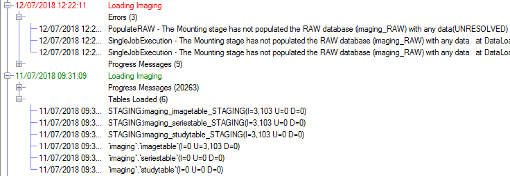
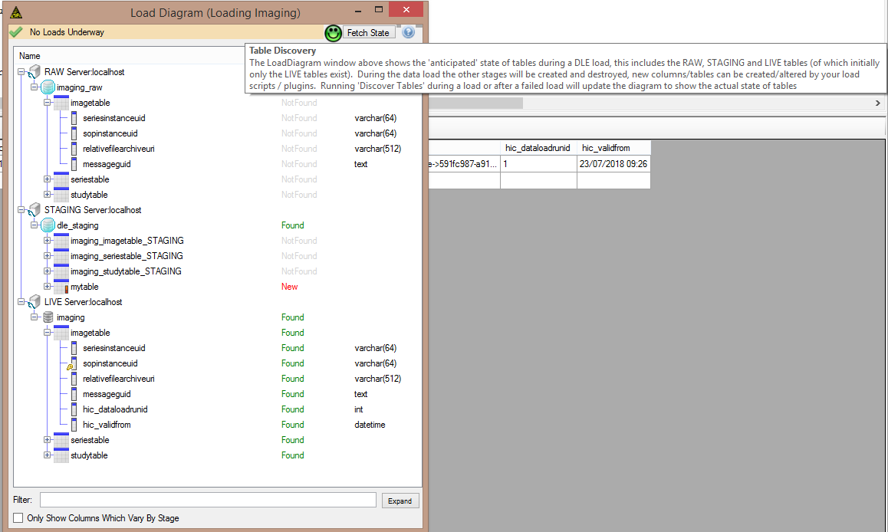

# DicomRelationalMapper

Primary Author: [Thomas](https://github.com/tznind)

## Contents

1.  [Overview](#1-overview)
2.  [Setup / Installation](#2-setup--installation)
3.  [Queue Settings](#3-queue-settings)
4.  [Config](#4-config)
5.  [Expectations](#5-expectations)
6.  [Adding Tags](#6-adding-tags)
7.  [Audit](#7-audit)
8.  [Class Diagram](#8-class-diagram)

### 1. Overview

Runs an RDMP data load configuration (`LoadMetadata`) with a batch of `DicomFileMessage` to load Dicom Tag data into a relational database (MySql or Microsoft Sql Server). It is designed to work on many images at once for performance. The load configuration is configurable through the main RDMP client.

### 2. Setup / Installation

#### 2.1 RDMP / Imaging dataset load setup

-   [Install and setup RMDP](https://github.com/HicServices/RDMP#install)
-   [Install Rdmp.Dicom plugin and setup imaging tables](https://github.com/HicServices/RdmpDicom/tree/develop#using-plugin) (Ensure Json sources is selected for the pipeline)
-   Clone this repository and build. Any NuGet dependencies should be automatically downloaded
-   Edit the yaml.default with the configuration for your environment
-   Run DicomRelationalMapper

#### 2.2 Tests setup

-   In order to run database tests (and after each RDMP platform API schema change) you will need to [create TEST\_ platform databases](https://github.com/HicServices/RDMP/blob/master/Documentation/CodeTutorials/Tests.md). DatabaseCreation.exe will be in the bin directory of any Test project referencing HIC.RDMP.Plugin.Test.

### 3. Queue Settings

| Read/Write | Type             | Config setting                         |
| ---------- | ---------------- | -------------------------------------- |
| Read       | DicomFileMessage | DicomRelationalMapperOptions.QueueName |

### 4. Config

| YAML Section                 | Purpose                                                                                                                                                                                                                                                                                                                                                                                                  |
| ---------------------------- | -------------------------------------------------------------------------------------------------------------------------------------------------------------------------------------------------------------------------------------------------------------------------------------------------------------------------------------------------------------------------------------------------------- |
| RabbitOptions                | Describes the location of the rabbit server for sending messages to                                                                                                                                                                                                                                                                                                                                      |
| RDMPOptions                  | Describes the location of the Microsoft Sql Server RDMP platform databases which keep track of load configurations, available datasets (tables) etc                                                                                                                                                                                                                                                      |
| DicomRelationalMapperOptions | The queue from which to read DicomFileMessage and the ID of the `LoadMetadata` load configuration. A load configuration is a sequence of steps to modify/clean data such that it is loadable into the final live tables. The LoadMetadata is designed to be modified through the RMDP user interface and is persisted in the LoadMetadata table (and other related tables) of the RDMP platform database |

| Command Line Options | Purpose                                         |
| -------------------- | ----------------------------------------------- |
| CliOptions           | Allows overriding of which yaml file is loaded. |

### 5. Expectations

DicomRelationalMapper is expected to be robust and able to load all Dicom files it is given as input (The input is anonymised images from another service so we know the images are processable). The load logic relies on the LoadMetadata configuration which is customisable through the RDMP application.

Errors are [logged as normal for a MicroserviceHost](../../common/Smi.Common/README.md#logging)

#### Data Failure States

-   Dicom file that is not a valid .dcm file (`TestLoadingOneImage_SingleFileMessage`)
    -   Ignores the image file and processes rest of directory
-   Empty Directory
    -   All invalid messages are automatically Nacked with reque flag false (`TestDodgyDirectories`)
-   Dicom data corrupt (missing primary keys, tag conflicts etc)
    -   Data batch is failed, exe stops accepting new messages until someone has resolved the problem\*

\*This is the current system behaviour because we are assuming the dicoms are all relatively processable and that we can build in a system for resolving collisions that makes sense in the load configuration relatively easily. Therefore any problems that arise during load that cause it to crash out should be rare and require fixes to be applied across the board.

#### Environmental Failure States

-   Operation on loss of RabbitMQ connection during a load:
    -   In progress data loads will complete and process will crash on BasicAck (leaving messages unacknowledged). Repeat processing of stale messages (by other instances) will not introduce duplication.
-   Operation on loss of Microsoft SQL Server connection during a load:
    -   Data load batch will fail and all messages will be Nacked. Live data integrity will be maintained since final load step is applied in a transaction (Staging=>Live merge).
-   Operation on data load error (e.g. corrupt files / file system down).
    -   Data load batch will fail and all messages will be Nacked. Raw/Staging will be left available for diagnostics/debugging

### 6. Adding Tags

Relational database tables have an initial schema out of the box based on a [image template](https://github.com/HicServices/RdmpDicom/blob/develop/Documentation/DataLoad.md#Image-Tables).

Once the system has gone live, data analysts will still be able to add new tags to existing database tables through the RDMP user interface using [tag promotion](https://github.com/HicServices/RdmpDicom/blob/develop/Documentation/DataLoad.md#Image-Tables).

### 7. Audit

In addition to logging to NLog like other microservices, the data load itself will be audited in the RDMP relational logging database. This includes facts such as how many records were loaded (UPDATES / INSERTS) and any problems encountered.

In order to improve traceability the 'image' table of every set of imaging database tables (Study + Series + Image) has a field `messageguid` which contains the Guid of the input message to DicomRelationalMapper that resulted in the record being part of the batch. This guid can be traced back through the file [logs](../Microservices.Common/README.md#logging) to see all microservices that acted to result in that record being in the final live database.

Finally all tables (Study, Series and Image) have a validFrom and a dataLoadRunId field which record which load batch they were last part of and when it was executed.

In the event that a load fails (e.g. due to primary key collisions) the RAW / STAGING databases that contain data being worked on in the load are left intact for debugging. In such a case all messages in the batch are Nacked.

### 8. Class Diagram

