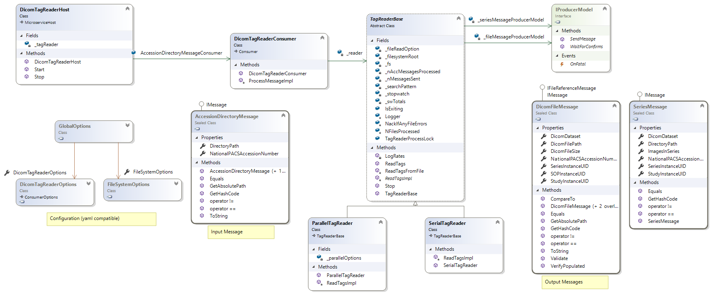

# DicomTagReader

Primary Author: [Ruairidh MacLeod](https://github.com/rkm)

## Contents

1.  [Overview](#1-overview)
2.  [Setup / Installation](#2-setup--installation)
3.  [Exchange and Queue Settings](#3-exchange-and-queue-settings)
4.  [Config](#4-config)
5.  [Expectations](#5-expectations)
6.  [Class Diagram](#6-class-diagram)

### 1. Overview

Opens dicom files found in `AccessionDirectoryMessage` directories and converts to JSON as a `DicomFileMessage`. Also creates a summary record of the whole series as a `SeriesMessage`.

### 2. Setup / Installation

-   Clone the project and build. Any NuGet dependencies should be automatically downloaded
-   Edit the default.yaml with the configuration for your environment

### 3. Exchange and Queue Settings

| Read/Write | Type                      | Config setting                                |
| ---------- | ------------------------- | --------------------------------------------- |
| Read       | AccessionDirectoryMessage | `DicomTagReaderOptions.QueueName`             |
| Write      | DicomFileMessage          | `DicomTagReaderOptions.ImageProducerOptions`  |
| Write      | SeriesMessage             | `DicomTagReaderOptions.SeriesProducerOptions` |

### 4. Config

| YAML Section          | Purpose                                                                                                                                                                                      |
| --------------------- | -------------------------------------------------------------------------------------------------------------------------------------------------------------------------------------------- |
| RabbitOptions         | Describes the location of the rabbit server for sending messages to.                                                                                                                         |
| FileSystemOptions     | Describes the root location of all images this program will load, all `AccessionDirectoryMessage` processed by this microservice should be assumed to refer to images relative to this root. |
| DicomTagReaderOptions | Contains names of the series and image exchanges that serialized image tag data will be written to.                                                                                          |

| Command Line Options | Switch          | Purpose                                         |
| -------------------- | --------------- | ----------------------------------------------- |
| CliOptions           | -y, --yaml-file | Allows overriding of which yaml file is loaded. |

### 5. Expectations

Errors are [logged as normal for a MicroserviceHost](../../common/Smi.Common/README.md#logging)

### 6. Class Diagram

