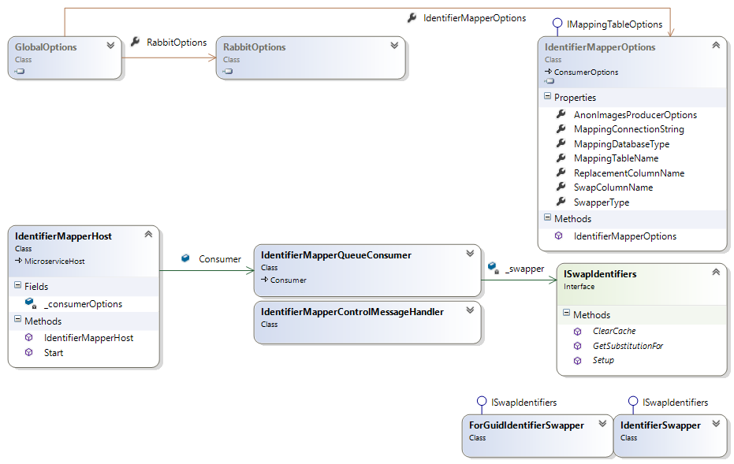

# IdentifierMapper

Primary Author: [Thomas](https://github.com/tznind)

## Contents

1.  [Overview](#1-overview)
2.  [Setup / Installation](#2-setup--installation)
3.  [Exchange and Queue Settings](#3-exchange-and-queue-settings)
4.  [Config](#4-config)
5.  [Expectations](#5-expectations)
6.  [Class Diagram](#6-class-diagram)

### 1. Overview

This service takes serialized Dicom file as `DicomFileMessage` messages and uses an `ISwapIdentifiers` to replace the top level `DicomTag.PatientID` tag for an anonymous representation. If there is no PatientID then the message is nacked. If the `ISwapIdentifiers` returns null then the message is nacked with the reason provided by `string GetSubstitutionFor(string toSwap, out string reason)`.

### 2. Setup / Installation

-   Clone the project and build. Any NuGet dependencies should be automatically downloaded
-   Edit the yaml.default with the configuration for your environment

    -   Pick an implementation of `ISwapIdentifiers` e.g. `Microservices.IdentifierMapper.Execution.IdentifierSwapper` and enter the full Type name into default.yaml `IdentifierMapperOptions.SwapperType`.
    -   Specify the mapping table database details\*
        -   MappingConnectionString, the connection string to use to connect to the mapping server
        -   MappingDatabaseType, either MicrosoftSQLServer or MYSQLServer
        -   MappingTableName, the table on the mapping server that contains the identifier mapping table\* (identifiable=>anonymous)
        -   SwapColumnName, the column in the `MappingTableName` that will contain the expected (identifiable) input values to replace.
        -   ReplacementColumnName, the column in the `MappingTableName` that contains the replacement values.

-   Decide if you want to [use a Redis](#Redis) cache.

\*The table/connection string details are at the disposal of the `ISwapIdentifiers` chosen. Some might ignore them completely or might manually create the mapping table themselves (e.g. `ForGuidIdentifierSwapper`)

### 3. Exchange and Queue Settings

| Read/Write | Type             | Config setting                                      |
| ---------- | ---------------- | --------------------------------------------------- |
| Read       | DicomFileMessage | `IdentifierMapperOptions.QueueName`                 |
| Write      | DicomFileMessage | `IdentifierMapperOptions.AnonImagesProducerOptions` |

Expects to receive control messages informing it to 'refresh' it's mapping table.

### 4. Config

| YAML Section            | Purpose                                                                                                                     |
| ----------------------- | --------------------------------------------------------------------------------------------------------------------------- |
| RabbitOptions           | Describes the location of the rabbit server for sending messages to.                                                        |
| IdentifierMapperOptions | Describes location of the mapping table (e.g. CHI=>EUPI), the Type responsible for mapping and all queue/exchange settings. |

| Command Line Options | Purpose                                         |
| -------------------- | ----------------------------------------------- |
| CliOptions           | Allows overriding of which yaml file is loaded. |

### 5. Redis

If you are using an `ISwapper` implementation that consults a large mapping database e.g. 10 million then you may benefit from using a Redis caching database. Install Redis and set the `RedisHost` option in the config file e.g.

```yaml
IdentifierMapperOptions:
    SwapperType: "Microservices.IdentifierMapper.Execution.Swappers.TableLookupSwapper"
    RedisHost: localhost
```

All lookup results will be cached in the Redis server (both successful lookups and misses).

If you update your lookup table you will have to manually flush the Redis server (if desired).

### 6. Expectations

All identifier allocation is handled by the chosen `ISwapIdentifiers`. The only field considered is `DicomTag.PatientID` which should be the only patient identifier field loaded by any downstream processes.

You should ensure the integrity of your mapping table yourself through an appropriate schema (e.g. not null, primary keys) to prevent 1->Many mappings and blank mappings etc at data load time. It is not the job of the `ISwapIdentifiers` to handle this.

#### Data Failure States

-   Dicom file doesn't contain a `DicomTag.PatientID`
    -   Nacked `Test_BlankPatientIdentifier`
-   PatientID not found by `ISwapIdentifiers`
    -   Nacked `Test_NoMatchingIdentifierFound`

#### Environmental Failure States

-   Operation on loss of RabbitMQ connection:
    -   No special logic
-   Operation on loss of access to mapping table:
    -   Any Exception thrown by the `ISwapIdentifiers` will not be caught triggering a Fatal on the `Consumer`.

### 6. Class Diagram


