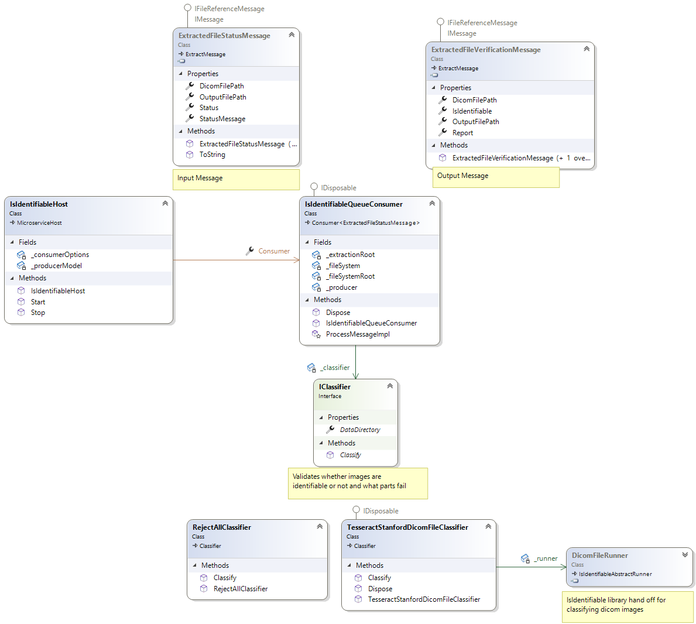

# IsIdentifiable

Primary Author: [Thomas](https://github.com/tznind)

## Contents

1.  [Overview](#overview)
1.  [Exchange and Queue Settings](#exchange-and-queue-settings)
1.  [Expectations](#expectations)
1.  [Class Diagram](#class-diagram)

## Overview

This service evaluates 'data' for personally identifiable values (e.g. names). It can source data from a veriety of places (e.g. databases, file system).

This service relies on the [IsIdentifiable](https://github.com/SMI/IsIdentifiable) library for identifying personal data. See the [docs on setting up rules](https://github.com/SMI/IsIdentifiable/blob/main/IsIdentifiable/README.md).

## Exchange and Queue Settings

In order to run as a microservice you should call it with the `service` option

| Read/Write | Type                  | Config setting                                                   |
| ---------- | --------------------- | ---------------------------------------------------------------- |
| Read       | ExtractFileMessage    | IsIdentifiableOptions.QueueName                                  |
| Write      | IsIdentifiableMessage | IsIdentifiableOptions.IsIdentifiableProducerOptions.ExchangeName |

## Config

| YAML Section          | Purpose                                                                                                                                                                                                                                                                                             |
| --------------------- | --------------------------------------------------------------------------------------------------------------------------------------------------------------------------------------------------------------------------------------------------------------------------------------------------- |
| RabbitOptions         | Describes the location of the rabbit server for sending messages to                                                                                                                                                                                                                                 |
| IsIdentifiableOptions | Describes what `IClassifier` to run and where the classifier models are stored. The key `DataDirectory` specifies the path to the data directory. The key `ClassifierType` specifies which classifier to run, typically `Microservices.IsIdentifiable.Service.TesseractStanfordDicomFileClassifier` |

## Expectations

> TODO:

### Data Failure States

> TODO:

### Environmental Failure States

> TODO:

## Class Diagram

