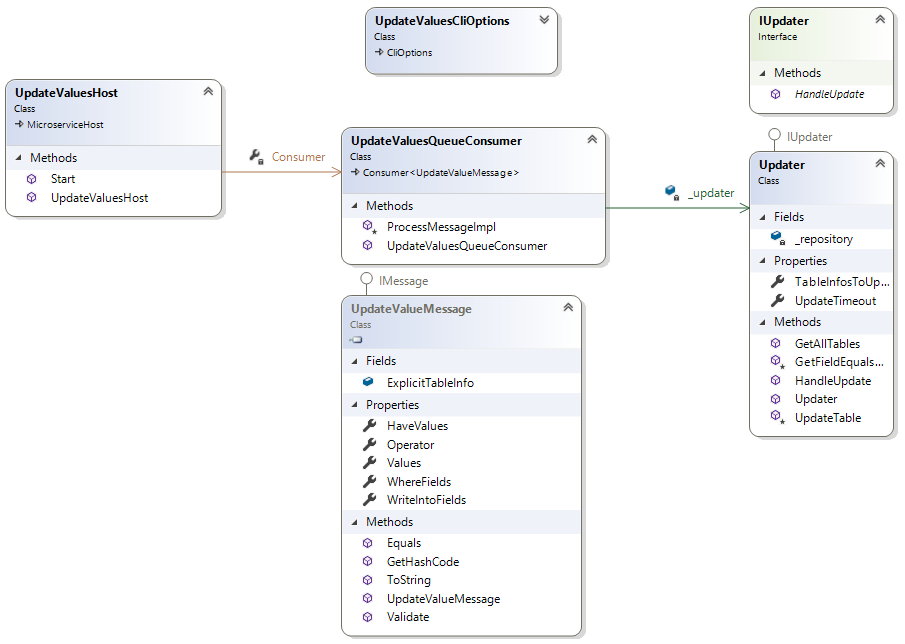

# Update Values

Primary Author: [Thomas](https://github.com/tznind)

## Contents

1.  [Overview](#1-overview)
2.  [Setup / Installation](#2-setup--installation)
3.  [Exchange and Queue Settings](#3-exchange-and-queue-settings)
4.  [Config](#4-config)
5.  [Expectations](#5-expectations)
6.  [Class Diagram](#6-class-diagram)

### 1. Overview

This service services `UpdateValuesMessage` which is a request to update a concept e.g. PatientID in one or more tables. Each message describes a single query (although multiple values can be updated at once).

### 2. Setup / Installation

-   Clone the project and build. Any NuGet dependencies should be automatically downloaded
-   Edit the yaml.default with the configuration for your environment
-   Optionally specify a list of **TableInfo** IDs in TableInfosToUpdate (otherwise all currently configured TableInfo will be used)

### 3. Exchange and Queue Settings

| Read/Write | Type                | Config setting                |
| ---------- | ------------------- | ----------------------------- |
| Read       | UpdateValuesMessage | UpdateValuesOptions.QueueName |

| Command Line Options | Purpose                                         |
| -------------------- | ----------------------------------------------- |
| CliOptions           | Allows overriding of which yaml file is loaded. |

### 4. Config

| YAML Section        | Purpose                                                                                                                                                                    |
| ------------------- | -------------------------------------------------------------------------------------------------------------------------------------------------------------------------- |
| RabbitOptions       | Describes the location of the rabbit server to pulling messages from                                                                                                       |
| RDMPOptions         | Describes the location of the Microsoft Sql Server RDMP platform databases which keep track of load configurations, available datasets to extract images from (tables) etc |
| UpdateValuesOptions | Which tables to update, timeouts etc                                                                                                                                       |

| Command Line Options | Purpose                                         |
| -------------------- | ----------------------------------------------- |
| CliOptions           | Allows overriding of which yaml file is loaded. |

### 5. Expectations

Each message processed will result in one or more UPDATE SQL statements being run. These may run on different servers and different DBMS (Oracle, MySql, Sql Server, Postgres). This ensures a relatively consistent 'whole system' update of a given fact.

#### Data Failure States

-   No tables exist that contain the updated field(s)
-   The TableInfo in RDMP maps to a non existent table (e.g. if the database server has been shutdown or the table renamed/deleted)

#### Environmental Failure States

-   Operation on loss of RabbitMQ connection:
    -   No special logic

### 6. Class Diagram

